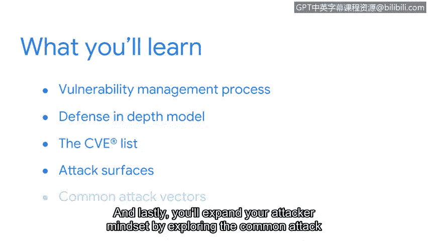

# 068：欢迎来到第三周

在本节课中，我们将要学习漏洞管理的基础知识。我们将探讨漏洞管理的通用模型、漏洞的文档化方式、需要保护的攻击面，以及攻击者常用的攻击向量。

我们已经一起学习了很多内容。我们已到达本课程的中点。

希望你已对这个令人兴奋的领域及其提供的机会有了更清晰的认识。最重要的是，希望你在学习过程中感到愉快。

我们的旅程已走过很长一段路。当我们一起开始时，我们认识了每个安全计划的三个基本构建模块：资产、威胁和漏洞。

早期我们重点讨论了资产，以及安全专业人员致力于保护的广泛事物。随后我们将注意力转向资产安全的一个核心组成部分：保护资产。

你学习了保护敏感信息的重要性。你也学习了一些防止信息丢失或被盗的安全控制措施。

在接下来的旅程中，我们将把焦点转向漏洞。我们保护的每一项资产都有一系列我们需要了解的漏洞或缺陷。

及时了解这些信息是保护个人和组织免受伤害的关键部分。在课程的下一部分，你将理解漏洞管理流程。

首先，你将探索一种常见的漏洞管理方法：纵深防御模型。

然后，你将学习漏洞如何在诸如CVE列表这样的在线库中被记录。我们将讨论安全团队需要保护的攻击面。

最后，你将通过探索网络犯罪分子试图利用的常见攻击向量，来扩展你的攻击者思维。

安全分析师在识别和纠正系统漏洞方面扮演着重要角色。我知道我很期待继续探索。你呢？那我们开始吧。

本节课中我们一起学习了第三周的课程概述，明确了接下来将重点学习漏洞管理流程、纵深防御模型、CVE漏洞库、攻击面以及常见攻击向量。安全分析师在识别和修复系统漏洞方面起着至关重要的作用。