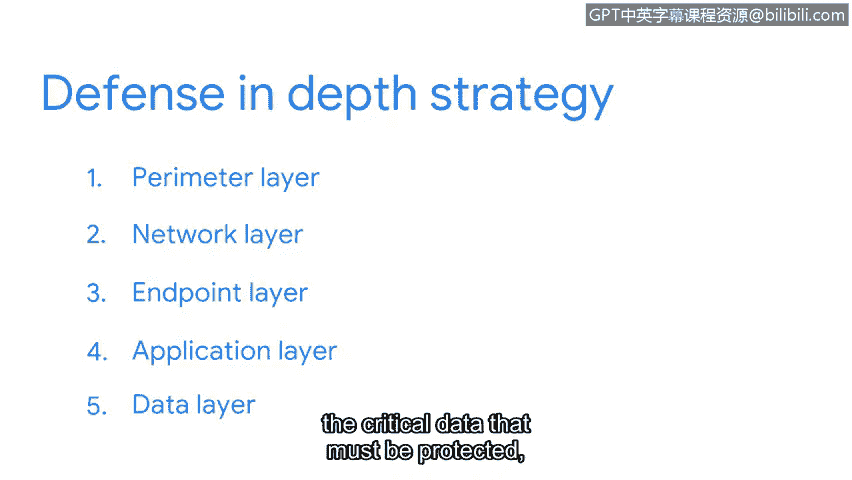

# 070：纵深防御策略

在本节中，我们将学习纵深防御策略。这是一种通过构建多层安全防护来管理漏洞、降低风险的安全模型。我们将了解其核心概念、各层级的构成以及它们如何协同工作。

---

## 概述：什么是纵深防御？

纵深防御是一种借鉴了“城堡式”多层防护理念的安全模型。其核心思想是：**当一层防护失效时，另一层防护能够立即接替，以阻止攻击**。这种分层方法使得攻击者难以穿透整个防御体系。

上一节我们介绍了漏洞管理的基本概念，本节中我们来看看如何通过分层策略来系统地实施防护。

---

## 多层防御的工作原理

一个分层的防御体系很难被攻破。当一道屏障失效时，另一道屏障会接替其位置以阻止攻击。纵深防御正是利用了这一概念的安全模型。

纵深防御通常被称为“城堡法”，因为它类似于中世纪城堡的分层防御体系。这些建筑结构在当时极难被攻破，它们具备多种独特的防御设计，为攻击者设置了不同的挑战。

以下是城堡防御体系如何体现分层理念：

*   **护城河**：环绕城堡的水障，能阻止如大规模敌军这样的威胁接近城墙。
*   **巨石城墙**：成功越过第一层防御的少数士兵将面临攀登高大石墙的新挑战。
*   **瞭望塔**：如果攻击者试图利用“城墙可攀登”这一弱点，他们将遭遇由守卫者组成的另一层防御，守卫者会射箭阻止其攀登。

这些中世纪建筑的每一层防御都通过识别漏洞并实施安全控制来最小化攻击风险。即使一个系统失效，还有其他系统在起作用。纵深防御的工作方式与此类似。

---

## 纵深防御的五层模型

纵深防御概念可用于保护任何资产。在网络安全领域，它主要采用**五层设计**来保护信息。信息在网络中传输时，会进出这个模型，每一层都配备了一系列安全控制措施来保护它。

以下是构成纵深防御模型的五个关键层级：

1.  **外围层**
    这是纵深防御的第一层。它主要是一个用户认证层，用于过滤外部访问。其功能是只允许受信任的伙伴访问下一层防御。该层包含我们已探讨过的一些技术，例如**用户名和密码**。

2.  **网络层**
    第二层是网络层，它更侧重于授权。该层由其他技术构成，例如**网络防火墙**等。

3.  **终端层**
    接下来是终端层。终端指的是可以访问网络的设备，例如**笔记本电脑、台式机或服务器**。保护这些设备的技术示例包括**防病毒软件**。

4.  **应用层**
    之后我们来到应用层。这包括用于与技术交互的所有界面。在这一层，安全措施被编程为应用程序的一部分。一个常见的例子是**多因素认证**。您可能熟悉需要同时输入密码和短信验证码的流程，这就是应用层防御的一部分。

5.  **数据层**
    最后，第五层防御是数据层。到达这一层，我们就触及了必须保护的关键数据，例如**个人身份信息**。在这最后的防御层中，一项重要的安全控制是**资产分类**。

正如前面提到的，每当信息通过网络交换时，它都会进出这五个层级。

---

## 总结与展望

本节课中，我们一起学习了纵深防御策略。除了我们提到的少数几个之外，纵深防御模型还包含更多的安全控制措施。许多企业都使用纵深防御模型来设计其安全系统。

理解这个框架，希望能让您更好地了解一个组织的各项安全控制措施是如何协同工作，以保护重要资产的。下一节，我们将探讨其他类型的安全模型和控制措施。