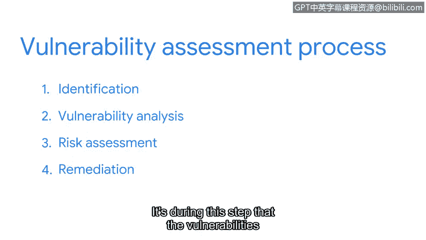

# 072：漏洞评估

在本节课中，我们将要学习漏洞管理流程中的一个核心环节——漏洞评估。我们将了解其定义、目标、执行原因以及标准化的四步流程。通过学习，你将掌握安全团队如何系统地发现、分析和处理系统中的安全弱点。

## 漏洞评估概述 🔍

到目前为止，我们对漏洞管理流程的探讨主要集中在几个主题上。我们讨论了漏洞如何影响防御体系的设计，也探讨了常见漏洞是如何被共享的。然而，我们尚未涉及的一个关键话题是：漏洞最初是如何被发现的。

漏洞和缺陷通常是在**漏洞评估**过程中被发现的。漏洞评估是一个组织对其自身安全系统进行内部审查的过程。这些评估与识别和分类CVE列表上漏洞的过程类似。主要区别在于，组织的安全团队会自行执行评估、评定风险分数并修复漏洞。安全分析师在整个过程中扮演着关键角色。

总体而言，漏洞评估的目标是识别安全弱点并预防攻击。它也是安全团队判断其安全控制措施是否符合监管标准的方式。

## 执行漏洞评估的原因 🛡️

组织之所以频繁进行漏洞评估，是因为公司需要保护的资产数量庞大。安全团队有时需要通过漏洞评估来选择需要重点关注的领域。一旦确定了重点，漏洞评估通常会遵循一个标准化的四步流程。

## 漏洞评估的四步流程 📋

以下是漏洞评估的标准四步流程。

### 第一步：识别

在识别步骤中，会使用扫描工具和手动测试来发现漏洞。其目标是了解安全系统的当前状态，就像为其拍一张快照。在识别步骤之后，通常会出现大量的发现结果。

### 第二步：漏洞分析

在分析步骤中，会对已识别的每一个漏洞进行测试。这个过程就像扮演数字侦探，其目标是找到问题的根源。

### 第三步：风险评估

在风险评估步骤中，会为每个漏洞分配一个风险分数。这个分数基于两个因素来评定：如果该漏洞被利用，其影响的严重程度；以及这种情况发生的可能性。在前两个步骤中发现的漏洞数量，常常会超过可用于修复它们的人力资源。风险评估是一种根据分数来优先分配资源、处理需要解决的漏洞的方法。

### 第四步：修复

修复是漏洞评估的第四步也是最后一步。正是在这个步骤中，那些可能对组织产生影响的安全漏洞得到了处理。修复行动取决于在风险评估步骤中分配的严重性分数。流程的这一部分通常是安全人员与IT团队共同努力的结果，旨在找出修复先前发现的漏洞的最佳方法。

修复步骤的示例可能包括：强制执行新的安全程序、更新操作系统或实施系统补丁。

## 总结与展望 🚀

漏洞评估对于识别系统缺陷非常有效。大多数组织利用它在问题发生之前主动搜寻隐患。但是，我们如何知道该从哪里开始搜寻呢？在接下来的课程中，我们将一起探索公司是如何解决这个问题的。

本节课中，我们一起学习了漏洞评估的定义、目的及其标准化的四步流程：**识别**、**分析**、**风险评估**和**修复**。理解这个流程是构建有效漏洞管理能力的基础。