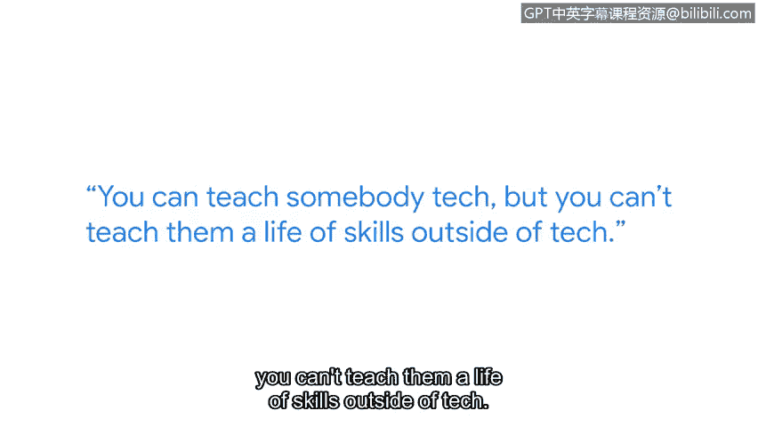

# 073：我的网络安全学习之旅

## 概述
在本节课中，我们将跟随谷歌企业运营工程师Ohmad的分享，了解他从一名狱警转型为网络安全工程师的职业历程。我们将学习到非技术背景如何转化为进入科技行业的优势，以及如何将过往经验应用于网络安全领域。

## 从执法到科技的转型之路
我的名字是Ohmad。我是谷歌的一名企业运营工程师。我的工作就是解决问题。谷歌员工会遇到问题。他们需要找人沟通。通常他们会来找我们。

如果你在我18岁时问我，我现在会做什么。我绝不会告诉你我会成为一名安全工程师。我可能会告诉你我会在监狱工作，或者成为一名警察。在某个小镇，做着朝九晚五的常规工作。

高中毕业后，我去了新泽西州唯一一所最高安全级别的监狱——特伦顿州立监狱工作。这份工作压力很大，但与此同时，那是我当时想做的事情。或者至少，我当时认为那是我想做的。

在成为一名惩教官员五年后，我再次参加了警长官员的考试。在那所培训学院的最后一天，我决定这不适合我。我厌倦了趴在地上做俯卧撑。我厌倦了被大声呵斥。

## 开启新的职业搜索
我回到家，做了每个人都会做的事：进行谷歌搜索。我看到了一个谷歌的职位。列表顶部是一个驻留计划，我抱着试试看的心态申请了。我甚至告诉当时的朋友们我要申请这个，但我肯定进不去。我没有任何推荐人或人脉。我不认识任何在谷歌工作的人。

几天之内，一位招聘人员联系了我。她说，我认为你非常合适。你是一名转行者。我喜欢你的申请和简历。我认为你会非常合适。所有的面试官都喜欢我的背景。他们欣赏我自学了很多东西，并且能在面试中与我产生共鸣。他们说，嘿，我也做过同样的事。从那时起，我得到了这份工作，并开始了我的职业生涯。

## 将非技术经验转化为优势
当我参加入职培训时，坐在我旁边的人实际上是普林斯顿大学的毕业生代表。而我，没有大学学位，没有相关背景，没有工作经验，却进入了同一家公司。

对于转行者而言，你拥有别人没有的东西，那就是不同的思维方式。你来自技术领域之外的经验，可以转移到技术领域。不要忘记，我们都拥有能在这个领域帮助你的技能组合。这正是雇主和招聘经理所寻找的。

## 过往经验在网络安全中的应用
我在担任惩教官员时学到的一件事是如何评估风险。每种情况都不同。就像安全领域一样。每种风险都不同。每个漏洞都不同。每个威胁都不同。你可以教别人技术。但你无法教给他们技术之外的生活技能。

## 总结与建议
如果我能打电话给18岁的自己，给出一个建议。那就是：不要害怕。去做吧。网络安全领域的职业生涯非常有趣。它充满挑战，会锻炼你的思维。它改变了我的生活。它也会改变你的。

---

**核心概念公式/代码示例：**
*   **风险评估思维：** `风险评估 = 识别资产(Asset) + 分析威胁(Threat) + 发现漏洞(Vulnerability)`
*   **技能迁移：** `职业竞争力 = 技术技能(Technical Skills) + 可转移技能(Transferable Skills)`

**关键要点：**
*   非技术背景的经验（如风险评估、压力管理、沟通）是网络安全领域的宝贵资产。
*   自学能力和成长型思维是成功转型的关键。
*   雇主看重多样化的背景和独特的解决问题的能力。
*   迈出第一步需要勇气，但回报是改变人生的职业生涯。

本节课中，我们一起学习了Ohmad从狱警到谷歌安全工程师的转型故事，理解了将生活经验和软技能成功迁移到技术领域的重要性，并获得了勇敢开启职业生涯新篇章的鼓励。