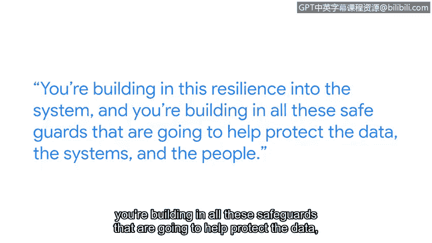

# 075：采用攻击者思维

## 概述
在本节课中，我们将学习如何建立并运用“攻击者思维”。这是一种从潜在攻击者的角度审视系统、挑战假设并发现安全弱点的关键方法。掌握这种思维模式对于构建更具防御性的系统和保护数据至关重要。

## 课程内容

大家好，我是Niro，负责领导谷歌的红队。谷歌的红队模拟试图入侵谷歌的攻击者。

他们作为蓝队的陪练伙伴。蓝队是负责构建安全控制措施、检测管道或响应事件的团队。我们通过模拟对手来帮助测试所有这些防御体系。我们入侵谷歌，是为了让入侵谷歌变得更困难。

这就像是，我们发现你的系统存在这些问题。现在，我们提供一些建议，并探讨如何帮助你修复它们。

采用攻击者思维，意味着像对手一样处理问题。

我通常倾向于以攻击者的方式思考。这始于我小时候玩电子游戏时，我常常会问：我必须按照游戏设计的方式通关吗？我必须走标准路径达成目标吗？审视一个系统并提出问题：我能入侵它吗？如何入侵？哪些环节可能失败？这能给我带来什么？这关乎拆解系统并试图理解它。

逆向思维是安全专业人员几乎所有工作的核心。

它关乎挑战假设。它关乎从不同角度看待事物，而不是从开发者的视角出发——开发者思考的是如何构建一个能为用户工作的系统。而你则戴上攻击者的帽子，思考：如果我审视这个系统，我会如何入侵它？

对于安全专业人员而言，采用攻击者思维非常重要，因为这样你能编写更具防御性的代码，构建更具防御性的系统，并以更具攻击性的方式去破坏系统。这意味着你在系统中构建了弹性，并建立了所有这些将有助于保护数据、系统和人员的安全保障措施。

为了建立我的攻击者思维，我所做的是去请教他人。这意味着我可以占用他们的时间，询问：嘿，你如何审视这个系统？你做了哪些假设？你如何构建你正在考虑的安全保障措施？

以下是我给那些试图建立攻击者思维的人的建议：

*   **与人交流**：无论是在本地聚会还是会议上。
*   **参与CTF小组**：找到一个夺旗赛小组，和他们一起参加比赛。
*   **观察团队协作**：看看团队中的每个人如何处理特定问题并为之努力。

如今，我们日常所做的几乎所有事情都在线上进行，例如网上银行、网上杂货购物。电网、供水系统也是如此。所有这些都在短时间内实现了联网。现在人们开始退一步思考：这对我们意味着什么？而网络安全工作者就是帮助确保这些系统被锁定并受到保护，以抵御这些对手的人。

如果你充满好奇心，喜欢拆解事物，喜欢解决问题，并且希望帮助确保事物安全，那么你应该加入网络安全领域。

## 总结
本节课中，我们一起学习了“攻击者思维”的核心价值。我们了解到，这种思维模式通过模拟对手、挑战系统假设和从不同视角审视漏洞，是构建强大防御体系的关键。通过与人交流、参与实践竞赛，我们可以培养这种思维，从而在保护日益数字化的世界基础设施和数据安全方面发挥重要作用。