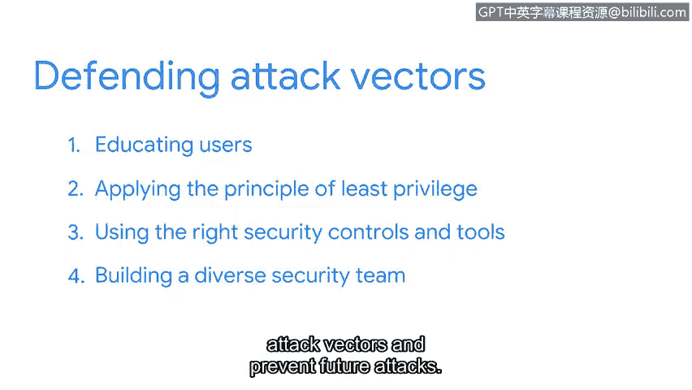

**网络安全基础：第五课：资产、威胁和漏洞**

**P76：攻击路径与防御策略**

**概述**
在本节课中，我们将学习攻击向量的概念，理解攻击者如何利用这些路径突破安全防线。我们将探讨如何通过培养攻击者思维来识别和评估这些路径，并介绍防御攻击向量的核心策略。

---

为了有效防御攻击，组织不仅需要了解其不断扩大的数字环境，还需要理解可能针对其发起的攻击类型。

上一节我们探讨了云技术如何扩展了组织需要保护的数字攻击面。因此，云计算也导致了可用攻击向量数量的增加。

**攻击向量**指的是攻击者用于渗透安全防御的路径，就像房屋的门窗一样。这些路径是攻击面上可被利用的特性。

攻击向量的一个例子是社交媒体。另一个例子是可移动介质，如USB驱动器。许多安全领域之外的人认为只有网络犯罪分子才会利用攻击向量。

虽然恶意黑客利用攻击向量窃取信息，但其他群体也会使用它们。例如，员工偶尔会无意中利用攻击向量。这在社交媒体平台上经常发生，有时员工会发布本不应分享的敏感公司信息。

同样的事情也可能故意发生。社交媒体平台也是心怀不满的员工用来故意分享可能损害公司的机密信息的向量。

我们都应将攻击向量视为资产安全的关键风险。攻击者通常在发动攻击前付出大量努力进行策划。作为安全专业人员，我们的责任是付出更大的努力来阻止他们。

安全团队通过以攻击者思维思考每个向量来实现这一点。这从一个简单的问题开始：**我们将如何利用这个向量？**

然后，我们通过一个逐步的过程来回答这个问题。

以下是实践攻击者思维的步骤：
1.  **识别目标**：这可以是特定信息、系统、个人、团体或组织本身。
2.  **确定访问方式**：基于可用信息，攻击者可能利用什么来接近目标？
3.  **评估可利用的攻击向量**：哪些攻击向量可以被利用以获取入口？
4.  **寻找攻击工具和方法**：攻击者将使用什么来实施攻击？

在此过程中，实践攻击者思维能为实施最佳安全控制措施和需要监控的漏洞提供宝贵的见解。

每个组织都有一长串需要防御的攻击向量。虽然保护方法很多，但有一些通用的规则。

以下是防御攻击向量的关键策略：
1.  **教育用户**：关键之一是教育用户了解安全漏洞。这些努力通常与特定事件相关联，例如，告知他们一种针对组织用户的新型网络钓鱼攻击。
2.  **应用最小权限原则**：我们之前在本节探讨过最小权限原则。其核心思想是访问权限应限制在执行任务所需的范围内。正如我们之前探讨的，这种做法可以封堵组织攻击面内的多个安全漏洞。
3.  **使用正确的安全控制和工具**：即使知识最渊博的员工也会犯安全错误，例如不小心点击电子邮件中的恶意链接。部署正确的安全工具，如防病毒软件，有助于更有效地防御攻击向量，并降低人为错误的风险。
4.  **组建多元化的安全团队**：这是降低攻击向量风险和预防未来攻击的最佳方法之一。你独特的视角可以极大地提高安全团队应用攻击者思维的能力，从而领先于潜在威胁一步。

在这个领域，保持信息灵通始终很重要。你已经有了一个良好的开端，请继续保持。

**总结**
本节课我们一起学习了攻击向量的概念及其作为攻击路径的角色。我们探讨了如何通过培养攻击者思维来模拟攻击步骤，从而识别潜在威胁。最后，我们介绍了防御攻击向量的核心策略，包括用户教育、应用最小权限原则、使用适当的安全工具以及组建多元化团队。理解并主动管理攻击向量是构建有效网络安全防御的关键。

