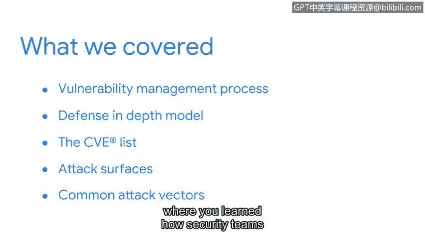

# 077：章节总结

在本节课中，我们共同学习了关于漏洞管理的核心知识，包括纵深防御模型、漏洞分类以及攻击面与攻击向量。现在，让我们对本节内容进行回顾与总结。

## 章节回顾

我们已抵达本节的终点。探索漏洞世界的过程充满乐趣，希望你也有同感。更重要的是，希望你对于数字世界的复杂环境有了更清晰的认识。这个环境中充满了攻击者可能利用来获取资产未授权访问的缺口，这使得防御工作充满挑战。

本次课程我们探讨了大量信息，现在快速回顾一下所学内容。

### 纵深防御模型

首先，你学习了漏洞管理流程，从**纵深防御模型**开始。你了解了这个安全框架的各个层级，以及它们如何协同工作以构建更强大的防御体系。

### 通用漏洞枚举列表

接着，你学习了用于发现和分类漏洞的**CVE列表**。这是你不断增长的安全工具箱中的一个重要补充。

### 攻击面

之后，你了解了企业需要保护的**攻击面**。我们讨论了物理和数字攻击面，以及防御云环境所面临的挑战。

### 攻击向量

最后，我们探讨了常见的**攻击向量**。在此部分，你学习了安全团队如何运用攻击者思维，来识别网络犯罪分子试图利用的安全缺口。

到目前为止，我们所讨论的每一个漏洞都面临着诸多威胁。

## 下节预告

当我们再次相聚时，将通过探索网络犯罪分子常用的特定攻击类型，进一步扩展我们的攻击者思维。我们将研究诸如恶意软件等工具，以及攻击者用于破坏防御系统的技术。通过了解这些工具和战术的工作原理，你将清晰地认识到它们构成的威胁。最后，我们将通过调查安全团队如何阻止这些威胁损害组织运营、声誉，以及最重要的——其客户和员工，来结束相关探讨。

你已经取得了出色的进展。当你准备好时，让我们共同完成这段旅程。期待再次与你相见。