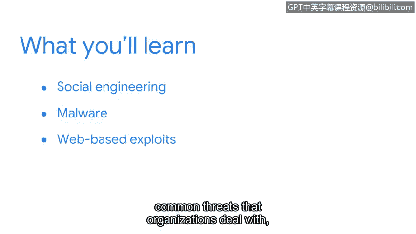

**谷歌网络安全专业证书第五课：《资产、威胁和漏洞》：第4周：欢迎来到第4周**

在本节课中，我们将进入课程的最后一个部分，重点学习网络安全中的**威胁**。我们将探讨社会工程学、恶意软件、基于网络的攻击等常见威胁类型，并了解威胁建模的基本过程。理解这些威胁是安全分析师工作的核心。

到目前为止，你已经投入了大量的时间、专注和努力，取得了出色的进展。现在，让我们集中精力，为课程画上一个圆满的句号。

---

上一节我们探讨了资产、漏洞以及用于保护它们的控制措施。这两个主题的一个共同点是，资产和漏洞的种类繁多。**威胁**的世界也同样如此。

如果你还记得，**威胁**是指任何可能对资产产生负面影响的状况或事件。在本部分课程中，你将通过概览当今组织面临的最危险威胁，来进一步拓展你的安全思维。

以下是本部分课程的主要内容：

首先，我们将从探索**社会工程学**策略开始。这是攻击者用来获取资产未授权访问权限的心理欺骗手段。

接下来，我们将探讨一种自个人计算机诞生之初就存在的常见威胁类型：**恶意软件**。我们将花些时间研究主要的恶意软件类型。

之后，我们会将注意力转向**基于网络的攻击**。如今大多数组织都在数字空间中运营，其中许多还是新手。在本节中，你将了解组织在网上面临的一些最常见威胁。

最后，在探讨了组织需要应对的常见威胁之后，我们将以学习**威胁建模**过程来结束本周内容。

理解威胁对于安全分析师至关重要，并且内容非常丰富。让我们开始吧。

---

本节课中，我们一起学习了第4周的课程概述。我们明确了**威胁**的定义，并预告了即将深入探讨的社会工程学、恶意软件、网络攻击和威胁建模等核心主题。掌握这些知识是构建有效防御体系的基础。