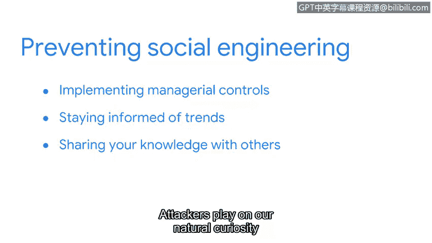

# 079：说服的艺术

在本节课程中，我们将学习社会工程学攻击。这是一种不依赖复杂编程技术，而是利用人性弱点来实施的网络犯罪。我们将了解其定义、攻击阶段以及防御方法。

---

当听到“网络罪犯”这个词时，你脑海中会浮现什么画面。

你可能会想象一个黑客在黑暗的房间里弯腰对着电脑。如果这是你想到的画面。

你并非个例。事实上，这是安全领域外大多数人的想法。

但网络罪犯与现实世界中作恶的人并非总是截然不同。

恶意黑客只是网络罪犯的一种类型。

他们是依赖复杂的计算机编程技能来实施攻击的特定群体。

还有其他不需要编程技能的犯罪方式。

有时罪犯会依赖更传统的方法。

社会工程学是一种利用人为错误来获取私人信息、访问权限或贵重物品的操纵技术。这些策略诱骗人们代表攻击者违反正常的安全程序。

这可能导致数据泄露、广泛的恶意软件感染或对受限系统的未授权访问。

社会工程学攻击可能发生在任何地方。它们发生在线上、面对面以及其他互动中。

攻击者使用许多不同的策略来实施攻击。

有些攻击可能只需几秒钟即可完成。例如。

有人冒充技术支持人员，向员工索要密码以“修复”其电脑。

其他攻击可能需要数月或更长时间，例如威胁行为者监控员工的社交媒体。

员工可能会发布评论，说自己在公司获得了一个新职位的临时工作机会。

攻击者可能会利用这样的机会，针对可能对安全程序不太了解的临时员工。

无论时间长短，知道要留意什么可以帮助你快速识别并阻止攻击。

社会工程学攻击包含多个阶段。第一阶段通常是准备。

在此阶段，攻击者收集关于其目标的信息。利用这些情报。

他们确定利用目标的最佳方式。在下一阶段，攻击者建立信任。

这通常被称为“借口制造”。在这里，攻击者利用之前收集的信息开启一条沟通渠道。

他们通常会伪装自己，以欺骗目标产生虚假的信任感。之后。

攻击者使用说服策略。这一阶段是前期准备真正发挥作用的时候。

此时，攻击者操纵其目标主动提供信息。

有时他们通过使用特定的词汇来实现这一点，让自己听起来像是组织内部成员。

😊，该过程的最后阶段是与目标断开联系。

在收集到所需信息后，攻击者中断与目标的沟通。

他们消失以掩盖踪迹。使用社会工程学的罪犯是隐秘的。

数字世界扩展了他们的能力。也创造了更多让他们不被察觉的方式。

尽管如此，我们仍有办法预防他们的攻击。

实施管理控制，如政策、标准和程序，是第一道防线之一。

例如，企业通常遵循NIST特别出版物800-40中定义的补丁管理标准。

这些标准用于创建更新操作系统、应用程序和可能被利用的固件的程序。

随时了解趋势也是任何安全专业人员的主要优先事项。

对抗社会工程学攻击更好的防御方法是与他人分享你的知识。

攻击者利用了我们天生的好奇心和乐于助人的愿望。😊。

他们希望目标不会对正在发生的事情思考太多。

向他人传授攻击的迹象，对于预防威胁大有帮助。

社会工程学对个人和组织的资产与隐私构成威胁。

恶意攻击者使用各种策略来迷惑和操纵其目标。

下次我们再聚时，我们将探讨最常用的技术之一。

这对各种规模的组织来说都是一个主要问题。

---

**总结**

本节课中，我们一起学习了社会工程学攻击。我们了解到，这种攻击不依赖技术漏洞，而是利用人类心理和社交习惯。攻击过程通常包括准备、建立信任、说服和断开连接四个阶段。防御的关键在于提高安全意识、实施严格的管理控制，以及积极分享知识，让每个人都能识别并抵制此类操纵。