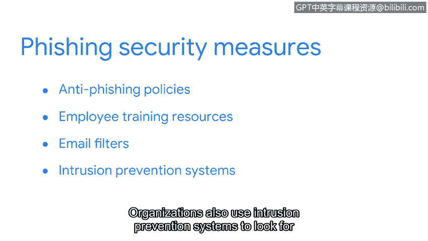

# 080：钓鱼攻击剖析与防御

## 概述
在本节课中，我们将要学习一种极为常见且危害巨大的社会工程学攻击形式——钓鱼攻击。我们将了解其定义、常用工具、不同变种以及组织和个人可以采取的基本防御措施。

网络犯罪分子倾向于选择那些能以最小努力造成最大破坏的攻击方式。符合这一描述的最流行的社会工程学形式之一就是钓鱼攻击。

钓鱼攻击是指利用数字通信手段欺骗人们，使其泄露敏感数据或部署恶意软件。钓鱼攻击利用了多种通信技术，但该术语主要用于描述通过电子邮件发起的攻击。

钓鱼攻击不仅影响个人，对组织也同样有害。一名员工落入此类圈套，就可能让恶意攻击者获得系统访问权限。一旦进入内部，攻击者就能窃取客户姓名和产品机密等敏感数据。

## 钓鱼工具包
上一节我们介绍了钓鱼攻击的基本概念，本节中我们来看看攻击者实施这些攻击时常用的工具——钓鱼工具包。

钓鱼工具包是发起钓鱼活动所需的一系列软件工具的集合。即使技术背景薄弱的人也可以使用这些工具包。其中的每个工具都旨在规避检测。作为一名安全专业人员，你应该了解钓鱼工具包内的三种主要工具，以便快速识别它们何时被使用并加以阻止。

以下是钓鱼工具包中常见的三种工具：

1.  **恶意附件**：这些是受感染的文件，可能对组织的系统造成损害。
2.  **伪造的数据收集表单**：这些表单看起来像合法的表单，例如调查问卷。但与真实的调查不同，它们会索要通常不会在电子邮件中询问的敏感信息。
3.  **欺诈性网页链接**：这些链接会打开恶意网页，这些网页被设计成看起来像受信任的品牌。与真实的网站不同，这些欺诈性网站旨在窃取登录凭据等信息。

## 钓鱼攻击的变种
了解了钓鱼攻击的核心工具后，我们来看看攻击者如何利用这些工具发起不同形式的攻击。

网络犯罪分子可以使用这些工具以多种形式发起钓鱼攻击。最常见的是通过恶意电子邮件。然而，他们也可以在其他形式的通信中使用它们。

最近，网络犯罪分子开始使用短信钓鱼和语音钓鱼来诱骗人们泄露私人信息。

*   **短信钓鱼**：指利用短信获取敏感信息或冒充已知来源。你可能以前收到过这类信息。短信钓鱼信息不仅烦人，而且难以预防，这也是一些攻击者发送它们的原因。有些短信钓鱼信息很容易识别，它们可能显示出恶意迹象，例如承诺点击一个本不该点击的链接即可获得现金奖励。但有时，短信钓鱼很难被发现。攻击者有时会使用本地区号来显得合法。一些黑客甚至能发送伪装成目标亲友的信息，诱骗他们泄露敏感信息。
*   **语音钓鱼**：指利用电子语音通信来获取敏感信息或冒充已知来源。在语音钓鱼攻击期间，犯罪分子会假装成他们不是的人。例如，攻击者可能打电话冒充公司代表。他们可能声称你的账户有问题，并声称如果你提供敏感信息，他们可以帮你修复。

## 防御钓鱼攻击
面对如此多样的钓鱼攻击手段，大多数组织会采用一些基本的安全措施来防止这些以及其他任何类型的钓鱼攻击成为问题。

例如，反钓鱼政策可以传播安全意识，并鼓励用户正确遵循数据安全程序。员工培训资源也有助于告知员工，当电子邮件看起来可疑时需要注意哪些事项。

对抗钓鱼攻击的另一道防线是保护电子邮件收件箱。电子邮件过滤器通常用于阻止有害信息到达用户。例如，可以使用阻止列表来屏蔽特定的电子邮件地址。组织还经常使用其他过滤器，如允许列表，来指定获准在公司内部发送邮件的IP地址。

此外，组织还使用入侵防御系统来查找电子邮件流量中的异常模式。安全分析师使用此类监控工具来发现可疑电子邮件，将其隔离并生成事件日志。

## 总结
本节课中我们一起学习了钓鱼攻击。钓鱼活动是一种流行且危险的社会工程学形式，各种规模的组织都需要应对。攻击者只要获得一个被泄露的密码，就可能导致代价高昂的数据泄露。现在你已经熟悉了这些攻击者使用的工具，你将更有能力识别钓鱼攻击并加以防范。