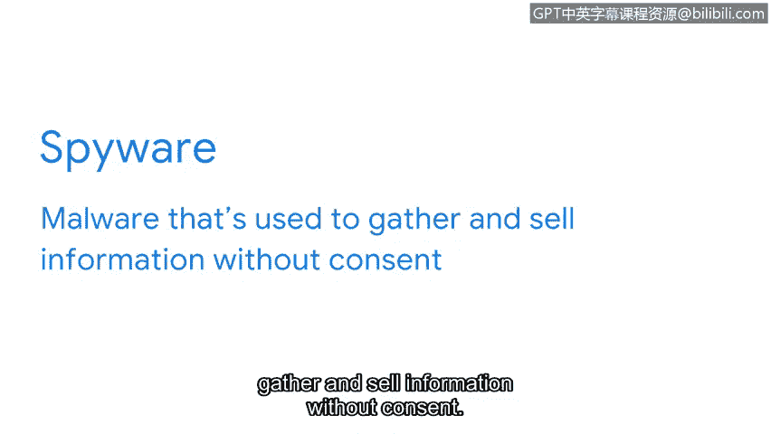

# 081：恶意软件

在本节课中，我们将学习恶意软件的基本概念及其主要类型。恶意软件是网络安全领域最常见的威胁之一，了解其工作原理是有效防御的第一步。

人与计算机有很大不同，但有一个方面是相似的：我们都容易受到“感染”。人类可能感染导致感冒或流感的病毒，而计算机则可能感染恶意软件。

**恶意软件**是旨在损害设备或网络的软件。恶意软件可以通过多种方式传播，例如通过受感染的U盘，或更常见地，通过在线方式在计算机间传播。连接到互联网的设备和系统尤其容易受到感染。当设备被感染后，恶意软件会干扰其正常操作。攻击者利用恶意软件在用户不知情或未经许可的情况下控制受感染系统。

恶意软件长期以来一直是个人和组织的威胁。攻击者创造了多种不同的恶意软件变种，它们的传播方式各不相同。五种最常见的恶意软件类型是：**病毒**、**蠕虫**、**木马**、**勒索软件**和**间谍软件**。

以下是这五种主要恶意软件的工作原理：

**病毒**是旨在干扰计算机操作并破坏数据和软件的恶意代码。病毒通常隐藏在可信的应用程序中。当受感染的程序启动时，病毒会自我复制并传播到设备上的其他文件。病毒的一个重要特征是，它必须由用户激活才能开始感染。

上一节我们介绍了需要用户激活的病毒，本节中我们来看看一种能自主传播的恶意软件。

**蠕虫**是一种能够自行复制并在系统间传播的恶意软件。病毒需要用户执行打开文件等操作才能复制，而蠕虫则利用受感染的设备作为宿主。它会扫描连接的网络以寻找其他设备，然后感染网络上的所有设备，而无需任何操作来触发传播。

病毒和蠕虫在感染设备之前，通常通过网络钓鱼邮件等方式传播。确保只点击来自可信来源的链接是避免此类感染的一种方法。然而，攻击者设计了另一种可以绕过此预防措施的恶意软件形式。

**木马**是一种看起来像合法文件或程序的恶意软件。其名称来源于古希腊特洛伊城的传说。在特洛伊，一群士兵藏在一个巨大的木马内，作为礼物送给敌人。木马被接受并带入城内。当晚，木马内的士兵爬出来攻击了城市。与这个古老的故事类似，攻击者设计的木马看起来无害。这种恶意软件通常伪装成文件或有用的应用程序，以诱骗目标安装它们。

攻击者经常使用木马来获取访问权限并安装另一种名为勒索软件的恶意软件。

**勒索软件**是一种恶意攻击，攻击者加密组织的数据并要求支付赎金以恢复访问权限。这类攻击如今已变得非常普遍。勒索软件攻击的一个独特之处在于，它们会让目标知晓其存在。如果不这样做，它们就无法收取所要求的赎金。通常，一旦支付赎金，它们就会解密被隐藏的数据。不幸的是，无法保证它们不会再次回来要求更多。

最后一种要提到的恶意软件是间谍软件。

**间谍软件**是一种用于在未经同意的情况下收集和出售信息的恶意软件。“同意”在这里是一个关键词。在这种情况下，组织也会收集其客户的信息，例如他们的浏览习惯和购买历史。然而，他们总是给予客户选择退出的权利。

另一方面，网络犯罪分子使用间谍软件来窃取信息。他们利用间谍软件攻击来收集登录凭证、账户PIN码和其他类型的敏感信息，以谋取个人利益。

除了这些之外，还有许多其他类型的恶意软件，并且新的形式一直在不断演变。它们都对个人和组织构成严重风险。下次，我们将探讨安全团队如何检测和清除此类威胁。

本节课中我们一起学习了恶意软件的定义、传播方式以及五种主要类型（病毒、蠕虫、木马、勒索软件、间谍软件）的基本工作原理。理解这些概念是构建有效网络安全防御体系的基础。