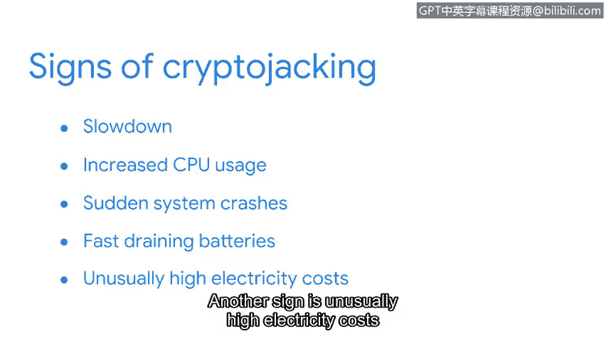

# 082：恶意软件的演变与加密货币劫持

在本节课中，我们将学习恶意软件的演变历程，并重点探讨一种较新的恶意软件形式——加密货币劫持。我们将了解其工作原理、如何识别其感染迹象，以及可以采取哪些主动防御措施来保护系统安全。

## 恶意软件的演变：从破坏到牟利

恶意软件几乎与计算机本身一样古老。在其早期形式中，它被麻烦制造者用作一种数字破坏手段。在当今的数字世界中，恶意软件已成为一种有利可图的犯罪形式，攻击者利用它来获取经济利益。

作为安全专业人员，了解恶意软件的最新演变至关重要。接下来，让我们仔细看看恶意软件演变的一种方式。

## 加密货币劫持：一种新型恶意软件

上一节我们介绍了恶意软件从破坏工具演变为牟利工具的历程。本节中，我们来看看一种较新的恶意软件类型——加密货币劫持。

勒索软件是攻击者用来窃取金钱的恶意软件类型之一。另一种较新的恶意软件类型是加密货币劫持。

**加密货币劫持**是一种通过安装软件来非法挖掘加密货币的恶意软件形式。你可能从新闻中听说过加密货币。如果你对这个话题不熟悉，**加密货币**是一种具有现实世界价值的数字货币，类似于物理形式的货币。它有许多不同类型，通常被称为**代币**。

简单来说，**加密货币挖矿**是获取新代币的过程。加密货币挖矿类似于挖掘黄金等其他资源的过程。挖掘黄金需要卡车和推土机等能挖掘土地的机械。而挖掘加密货币则使用计算机。计算机运行软件来挖掘数十亿行加密代码，而不是挖掘土地。当处理了足够多的代码时，就可能找到一个加密货币代币。

一般来说，参与挖矿的计算机越多，就能发现越多的加密货币。不幸的是，犯罪分子从2017年开始意识到了这一点。加密货币劫持恶意软件开始被用来未经授权地控制个人电脑以挖掘加密货币。

## 加密货币劫持的传播与检测

自那时起，加密货币劫持技术变得更加复杂。犯罪分子现在经常针对易受攻击的服务器来传播他们的挖矿软件。与受感染服务器通信的设备自身也会被感染。然后，恶意代码在后台运行，在无人知晓的情况下挖掘代币。

加密货币劫持软件很难被检测到。幸运的是，安全专业人员拥有可以帮助检测的复杂工具。**入侵检测系统**是一种监控系统活动并对可能的入侵发出警报的应用程序。当检测到异常活动时，例如恶意软件挖掘代币，IDS会向安全人员发出警报。

尽管检测系统很有用，但它们有一个主要缺点：新形式的恶意软件可能无法被检测到。幸运的是，有一些细微的迹象可以表明设备感染了加密货币劫持软件或其他形式的恶意软件。

以下是可能表明设备感染了恶意软件的迹象：

*   **速度变慢**：迄今为止，加密货币劫持感染最明显的迹象是设备运行速度变慢。
*   **CPU使用率增加**：处理器使用率异常升高。
*   **系统突然崩溃**：设备频繁或无故崩溃。
*   **电池快速耗尽**：设备电池电量消耗速度异常快。
*   **电费异常高**：由于加密货币挖矿是资源密集型过程，可能导致相关电费异常增高。

## 主动防御措施

了解如何识别感染迹象后，我们来看看可以采取哪些措施来降低遭受恶意软件攻击的风险。

同样重要的是，你可以采取某些措施来降低遭受加密货币劫持等恶意软件攻击的可能性。这些防御措施包括：

*   **使用旨在阻止恶意软件的浏览器扩展**：安装可靠的防恶意软件扩展。
*   **使用广告拦截器**：拦截可能包含恶意代码的在线广告。
*   **禁用JavaScript**：在非必要网站上禁用JavaScript，以减少攻击面。
*   **关注最新趋势**：保持对最新安全威胁和趋势的了解。

安全分析师还可以教育组织内的其他人防范恶意软件攻击。虽然加密货币劫持仍然相对较新，但正变得越来越普遍。网络犯罪分子传播的恶意代码类型也在不断演变。分析新形式的恶意软件需要多年的经验。尽管如此，你已经在帮助防御这些威胁的道路上迈出了坚实的一步。

## 总结

本节课中，我们一起学习了恶意软件如何从早期的数字破坏工具演变为现代的网络犯罪牟利手段。我们重点探讨了**加密货币劫持**这种恶意软件，了解了其利用受害者计算机资源非法挖掘**加密货币**的基本原理。我们还学习了如何通过设备**速度变慢、CPU使用率增高等迹象**来识别感染，并掌握了使用**浏览器扩展、广告拦截器**等主动防御措施来降低风险。保持警惕并持续学习是应对不断演变的网络威胁的关键。