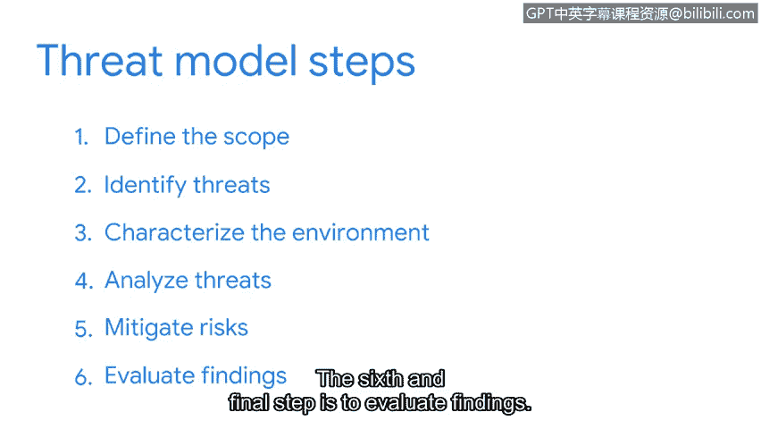

# 086：40_01_a-proactive-approach-to-security

## 概述 📋

在本节课中，我们将学习网络安全中的一项核心技能：威胁建模。这是一种主动的安全方法，旨在通过识别资产、漏洞和潜在威胁来为攻击做好准备。我们将详细拆解威胁建模的六个标准步骤，帮助你理解安全团队如何系统地评估和应对风险。

## 威胁建模简介 🛡️

为攻击做好准备是整个安全团队的一项重要职责。威胁行为者拥有多种工具，其具体选择取决于攻击目标。例如，攻击一家小型企业与攻击一家公共事业公司的方式可能截然不同，因为两者拥有不同的资产和特定的防御措施。在所有情况下，**预测攻击**是做好应对准备的关键。

在安全领域，我们通过执行一项称为**威胁建模**的活动来实现这一目标。威胁建模是一个识别资产、其漏洞以及每个资产如何暴露于威胁之下的过程。我们将威胁建模应用于我们保护的一切事物，包括整个系统、应用程序或业务流程，都会从这个与安全相关的视角进行审视。

创建威胁模型是一项冗长而详细的活动，通常由一群在该领域拥有多年经验的个人共同执行。因此，它被认为是网络安全中的一项高级技能。但这并不意味着你不会参与其中。业界使用多种威胁建模框架，有些更适合网络安全，有些则更适合信息安全或应用程序开发等领域。

## 威胁建模的六个步骤 🧩

上一节我们介绍了威胁建模的基本概念，本节中我们来看看一个通用的威胁建模过程所包含的六个核心步骤。

以下是威胁建模的六个标准步骤：

1.  **定义模型范围**：在此阶段，团队通过创建资产清单并对其进行分类，来确定他们要构建或保护的对象。
2.  **识别威胁**：在此，团队定义所有潜在的威胁行为者。**威胁行为者**是指任何构成安全风险的个人或团体。威胁行为者可分为内部和外部两类。例如，内部威胁行为者可能是一名故意损害资产的员工；外部威胁行为者可能是一名恶意黑客或商业竞争对手。
3.  **构建攻击树**：在识别威胁行为者之后，团队会构建所谓的**攻击树**。攻击树是一种将威胁映射到资产的图表。团队在构建此图表时会尽可能详细。
4.  **分析威胁**：在此步骤中，团队共同检查现有的防护措施并识别差距。然后，他们根据分配的风险评分对威胁进行排序。
5.  **决定风险缓解措施**：此时，团队制定防御威胁的计划。可选的策略包括：规避风险、转移风险、降低风险或接受风险。
6.  **评估结果**：在此阶段，记录演练期间所做的一切，应用修复措施，并记录取得的任何成功。

## 总结与回顾 🎯

本节课中我们一起学习了主动安全方法的核心——威胁建模。我们了解到，威胁建模是一个系统化的六步过程，从定义资产范围开始，到评估结果并记录经验教训结束。通过应用攻击者思维并构建攻击树等工具，安全团队可以提前识别漏洞并制定有效的防御策略。掌握这一流程的基本框架，是理解现代网络安全防御工作的基础。

团队还会记录所学的任何经验教训，以便为未来进行威胁建模提供参考。以上是对通用威胁建模过程的概述，我们所探讨的只是众多现有方法中的一种。

