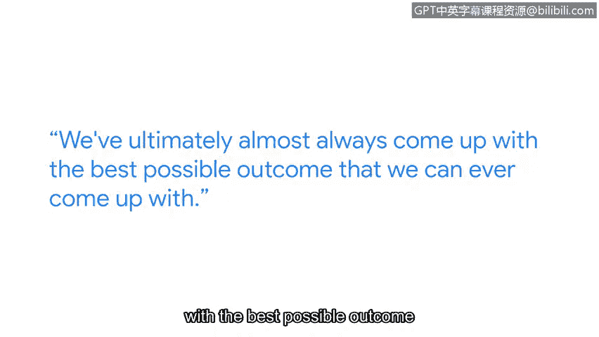

**谷歌网络安全专业证书：第五课：资产、威胁和漏洞**

**P87：网络安全中多样性的价值**

在本节中，我们将通过谷歌安全工程师Chel的分享，了解多样性在网络安全领域的重要性，以及她进入该行业的建议。

---

我的名字是Chel，我是谷歌的一名安全工程师，隶属于安全实施与扩展团队。我们的职责是保护和监控包含敏感信息的系统。

我的背景起初是打算成为一名心脏外科医生。但当我学习了化学课程后，我意识到那并不适合我。我对网络安全的兴趣源于一部名为《黑客军团》的电视剧。这部剧讲述了一位试图拯救世界的黑客义警的故事，它激发了我对安全的兴趣，并为我奠定了良好的基础。

---

上一节我们了解了Chel的职业背景，本节中我们来看看她如何看待团队多样性。

在网络安全领域重视多样性非常重要，因为这使我们能够接触到广泛的思维方式。这有助于激发许多创造性的想法、不同的视角以及解决问题的不同方法。这种多样性推动我们成为更优秀的安全工程师。

我们的经理Lauren经常提醒我们，不要急于寻找解决方案，也不要急于自己解决问题。我们拥有广泛的安全工程师资源和人际网络可供利用。她鼓励我们走出去寻求这些资源，然后回来集合，对我们收集到的所有想法进行头脑风暴。最终，我们几乎总能得出可能的最佳结果。

---

以下是Chel给希望进入网络安全行业的人的建议。

我的建议是积极主动地行动起来。我强烈建议尝试**Hack The Box**或**TryHackMe**这类实践平台。我也非常推荐加入Twitter上的安全社区。目前Twitter上有一个庞大的安全社区，分享大量资源、机会和职位信息，并且非常乐意与任何有兴趣进入这个领域但不知如何开始的人交流。

我推荐网络安全作为职业。对我个人而言，我发现在安全领域能够充分展现我“叛逆”的一面。我发现自己能在其中更充分地表达自我。这整个领域充满了机遇与挑战。

---

**总结**

本节课中，我们一起学习了网络安全工程师Chel的观点。她强调了多样性对于激发创意和解决问题的重要性，并分享了通过实践平台和社区参与进入该行业的实用建议。网络安全是一个充满活力且欢迎多元背景人才的领域。