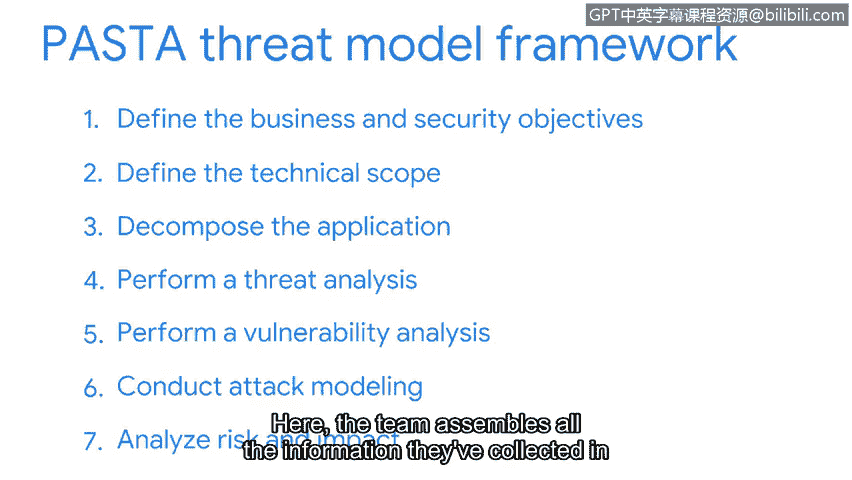

# 088：PASTA威胁建模框架详解


在本节课中，我们将通过一个真实场景来学习一个标准的威胁建模流程——PASTA框架。我们将跟随一家健身公司的安全团队，了解他们如何运用PASTA框架来评估其即将上线的移动应用的安全性，确保客户数据得到保护。

## 概述：什么是PASTA框架？🔍

PASTA是一个广泛应用于各行业的流行威胁建模框架，其全称是 **P**rocess for **A**ttack **S**imulation and **T**hreat **A**nalysis（攻击模拟与威胁分析流程）。它包含七个阶段，旨在通过结构化的方法识别、评估和管理安全风险。

上一节我们探讨了威胁建模的基本概念，本节中我们将详细拆解PASTA框架的七个阶段。

## PASTA框架的七个阶段 🗺️

### 阶段1：定义业务与安全目标 🎯

在开始威胁建模之前，团队需要明确目标。对于健身公司移动应用的例子，其主要目标是**保护客户数据**。团队在此阶段会提出大量问题，例如个人身份信息是如何处理的。回答这些问题对于后续评估威胁的影响至关重要。

### 阶段2：定义技术范围 📐

在此阶段，团队的重点是识别需要评估的应用程序组件，也就是我们之前讨论过的**攻击面**。对于一个移动应用，这包括数据处于风险和使用状态时所涉及的技术，例如网络协议、安全控制措施以及其他数据交互点。

### 阶段3：分解应用程序 🧩

团队的工作是分解应用程序，识别现有的、用于保护用户数据免受威胁的控制措施。这通常意味着需要与应用程序开发人员合作，绘制**数据流图**。这种图表会展示数据如何从用户设备传输到公司数据库，并标识出沿途保护这些数据的控制措施。

### 阶段4：进行威胁分析 🕵️

这是团队进入攻击者思维模式的阶段。团队需要进行研究，收集关于当前正在使用的攻击类型的最新信息。与其他技术一样，移动应用存在许多攻击向量，并且这些向量会定期变化，因此团队需要参考相关资源以保持信息更新。

### 阶段5：进行脆弱性分析 🔎

在此阶段，团队通过考虑问题的根源，更深入地调查潜在的脆弱性。

### 阶段6：进行攻击建模 ⚔️

团队通过模拟攻击，来测试在阶段5中分析过的脆弱性。团队会创建一个**攻击树**，它看起来像一个流程图。

以下是攻击树的一个示例分支：
```
攻击目标：客户信息（如用户名和密码）
├─ 数据存储位置：数据库
└─ 潜在攻击向量：SQL注入攻击
    └─ 利用方式：通过未净化的输入利用漏洞
```
安全团队使用此类攻击树来识别需要测试以验证威胁的攻击向量。这只是一个分支，像健身应用这样的应用程序通常会有许多包含其他攻击向量的分支。

### 阶段7：分析风险与影响 📊

在此阶段，团队整合在阶段1到阶段6中收集的所有信息。至此，团队已能够根据业务目标，向利益相关者提出明智的风险管理建议。

## 总结 📝

本节课中，我们一起学习了PASTA威胁建模框架。我们跟随一个健身应用的安全团队，逐步了解了如何通过定义目标、分析技术范围、分解应用、分析威胁与脆弱性、进行攻击模拟，最终完成风险评估。PASTA提供了一个系统化的方法，帮助安全专业人员从攻击者的角度思考，从而更有效地保护资产。



