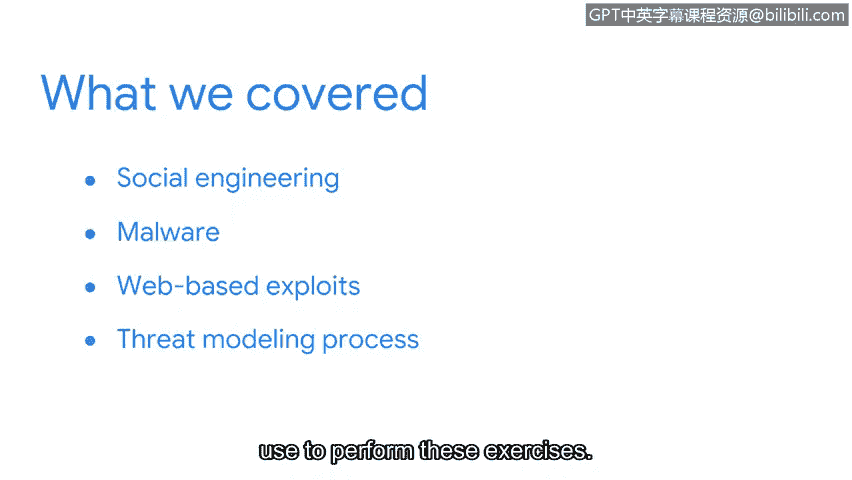

**谷歌网络安全专业证书：第五课：资产、威胁和漏洞：P89：课程总结**

在本节课中，我们学习了网络安全专业人员如何管理威胁。我们探讨了在安全领域中可能遇到的几种常见网络威胁类型。

上一节我们介绍了威胁建模过程，本节中我们来回顾一下本部分课程的核心内容。

以下是本部分课程涵盖的主要威胁类型：

*   **社会工程学**：攻击者利用人们的信任和乐于助人的心理，通过多种方式诱骗目标分享私人信息。**网络钓鱼攻击**是攻击者操纵目标最常见的手段之一。
*   **恶意软件**：我们讨论了恶意软件的主要类别，例如**病毒**、**木马**和**蠕虫**。你学习了如何识别系统感染的迹象，也了解了恶意软件如何随着时间演变并变得更加复杂。
*   **基于网络的攻击**：我们将注意力转向了基于网络的漏洞利用，特别是**注入攻击**。你学习了**跨站脚本攻击**和**SQL注入攻击**，这是组织在线面临的最常见的两种攻击类型。我们讨论了这些攻击是如何实施的，你也学习了如何保护Web应用程序免受恶意代码的侵害。
*   **威胁建模**：最后，我们探讨了威胁建模流程。你学习了安全团队用于执行这些分析的过程。

不幸的是，网络攻击和安全漏洞是我们经常需要面对的挑战。然而，了解存在的威胁类型以及威胁建模过程，为你作为安全分析师的工作奠定了重要的基础。

本节课中，我们一起学习了社会工程学、恶意软件、基于网络的攻击以及威胁建模流程，这些知识构成了识别和管理网络安全威胁的基础框架。