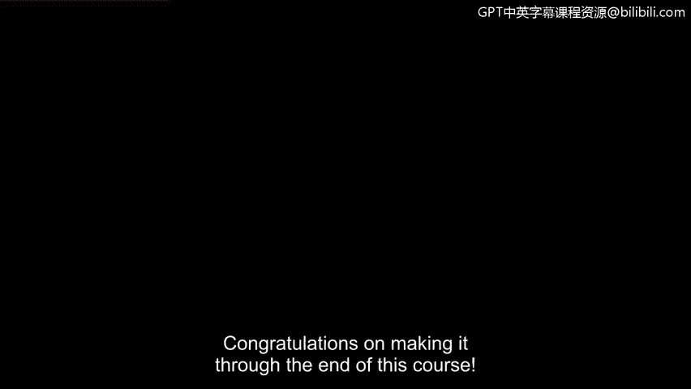
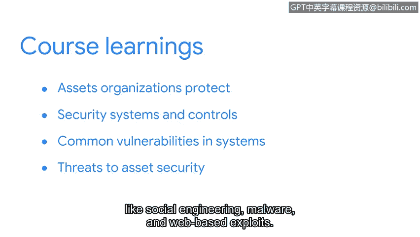

# 090：课程总结 🎉

在本节课中，我们将回顾并总结《资产、威胁和漏洞》这门课程的核心内容。我们将梳理从资产分类到威胁建模的整个学习路径，巩固您在本课程中获得的知识基础。

## 课程回顾

恭喜您完成本课程的学习。😊

我们共同度过的学习时光即将结束。在继续证书项目的后续课程之前，我们有必要回顾一下您所取得的卓越进步。

课程开始时，我们介绍了组织需要保护的各类**资产**。我们的主要焦点是信息安全，特别是数字信息。在此部分，您学习了**资产分类**如何帮助安全团队集中精力并优先分配资源。

我们探讨了数据的三种状态下的数字资产。同时，我们也学习了**政策、标准和程序**如何能够减轻组织风险。

通过对**NIS网络安全框架**的关注，我们向您介绍了一个常用的风险管理框架。

## 安全系统与控制基础

上一节我们介绍了风险管理框架，本节中我们来看看具体的安全防护措施。

随后，您学习了基础的安全系统和控制措施。😊 您探索了像**加密**这样的技术，它用于保护各种状态下的数据。您还学习了**公钥基础设施（PKI）**和**数字证书**等技术如何用于维护在线信息的**机密性、完整性和可用性**。

此外，您也探索了构成**认证、授权和记账（AAA）框架**的访问控制机制。

## 漏洞与威胁分析

了解了防护措施后，我们转向攻击者可能利用的弱点。

接下来，我们探讨了常见的漏洞和系统。在课程的这一部分，您深入了解了安全团队如何在攻击发生前进行布防。我们探讨了用于在线各方交换信息时进行保护的**防御深度策略**。

您还学习了**通用漏洞与暴露列表**、**漏洞评估流程**以及**攻击面**和**攻击向量**。

然后，我们探讨了对资产安全的主要威胁，例如**社会工程学**、**恶意软件**和**基于网络的攻击**。我们一起讨论了这些攻击是如何实施的，以及安全团队如何防止它们造成损害。

## 威胁建模

最后，我们以探索**威胁建模**流程作为课程的结束。我们涵盖的内容非常丰富，衷心感谢您全程的努力。

当我刚开始我的安全职业生涯时，我的目标是学习、建立人脉并抓住任何机会。我得以参加安全会议、获得工作建议、赢得推荐，并通过志愿服务积累经验。😊 那时，我从未想象过我会在这里将我学到的东西传授给他人。这恰恰说明，您的安全之旅才刚刚开始。

虽然我们的共同学习即将结束，但我们涵盖了许多复杂的主题，其中很多是安全领域的专业方向。凭借您在此奠定的基础，您在该领域继续成长拥有广泛的可能性。

我很高兴能在您踏入安全世界的这一步中贡献一份力量，并祝愿您在未来的道路上一切顺利。😊

## 总结

本节课中我们一起回顾了《资产、威胁和漏洞》课程的全部要点。我们从**资产分类**和**风险管理框架**出发，学习了**加密、PKI、AAA框架**等核心安全控制措施，进而分析了常见的**漏洞、攻击面与攻击向量**，并探讨了**社会工程学、恶意软件**等主要威胁及其防御策略，最后以**威胁建模**流程收尾。您已经为后续的网络安全学习建立了坚实的知识基础。