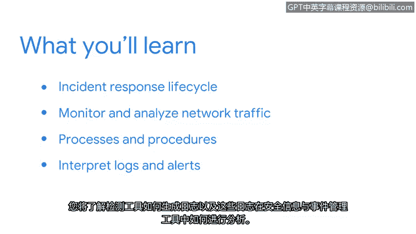

# 001：课程介绍 🚨

在本节课中，我们将要学习网络安全事件检测与响应的核心概念、工具及流程。课程旨在帮助初学者理解如何应对日益增长的安全威胁，并掌握从监控到分析再到响应的完整技能。

---

安全攻击正在增加，新的漏洞每周都会被利用和发现。

无论一个组织对安全攻击的准备多么充分，在某些时候，总会出现问题。无论是数据泄露、勒索软件，还是员工犯下的简单错误，安全事件总会发生。而有效响应这些安全事件，正是像您这样的安全专业人士的职责。

大家好，欢迎来到本课程。我是戴夫，是谷歌云的首席安全战略师。我拥有20年作为安全从业者和领导者的经验。在过去的八年里，我曾在像Forinette、Splunk和谷歌这样的行业领先安全供应商工作，并在此过程中专攻安全分析领域。

我热衷于帮助分析师们掌握在其职业生涯中取得成功所必需的技能。非常高兴您能来到这里。到目前为止，您已经做得非常出色，学习了许多关于安全概念、最佳实践和安全攻击类型的知识。

上一节我们介绍了课程背景和讲师，本节中我们来看看本课程的核心学习目标。

在本课程中，我们将重点关注事件的检测、分析与响应。您将有机会使用诸如TCP dump、Wireshark、Surracottta、Splunk和Chronicle等工具来应用所学知识。到本课程结束时，您将对事件响应有深入的理解。

以下是本课程将涵盖的主要学习模块：

*   **事件响应生命周期与团队协作**：首先，您将学习事件响应生命周期以及事件响应团队如何协同工作。
*   **检测与响应工具**：您还将学习检测和响应中使用的工具类型，包括文档工具。您将获得自己的事件处理者日志，用于在调查期间使用。
*   **网络流量分析**：接下来，您将应用您的网络和Linux知识来监控和分析网络流量，使用像Wireshark和TCP dump这样的数据包嗅探器来捕获和分析数据包，以寻找潜在的安全事件迹象。
*   **事件处理流程**：然后，您将熟悉事件检测和响应期间常用的流程和程序。您将学习如何使用调查工具来分析、验证事件并生成文档。
*   **日志与警报解读**：最后，您将学习如何解读日志和警报。您将了解检测工具如何生成日志，以及这些日志如何在安全信息和事件管理工具中被分析。

---

本节课中我们一起学习了《检测与响应》课程的总体介绍，明确了安全事件响应的必要性、课程讲师背景以及我们将要掌握的核心技能模块。接下来，我们将深入第一个模块，探索事件响应的生命周期。