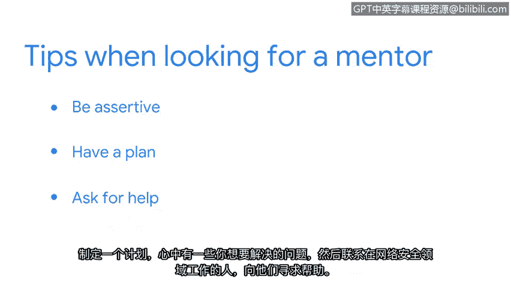

# 002：导师的价值与寻找方法 👨‍🏫

在本节课中，我们将学习网络安全专家Dave分享的职业发展经验，重点探讨导师在个人成长中的重要作用以及如何有效地寻找和建立导师关系。

我的名字是戴夫，我是谷歌云的首席安全战略师。我的工作是直接与安全从业者合作，帮助他们保护其所在组织。

我热爱这份工作的多样性。某一天我可能在为客户排查技术问题，第二天我可能在编写代码来解决某个特定问题。每一天都有新事物，我从不感到厌倦。

我是在美国中西部长大的孩子。我上大学时学习工程学。但我意识到自己并不真正喜欢工程学，而我爱上了计算机科学，我甚至不知道这是一个可选的专业。

## 从入门到专业：职业路径演变

上一节我们了解了Dave的背景，本节中我们来看看他具体的职业发展轨迹。他的经历展示了网络安全职业道路的多样性。

我在大学早期曾担任服务台人员。后来我找到了一份系统管理员的工作。我发现自己在一家支付行业的初创公司工作。我的工作从一名普通的IT人员转变为网络安全人员。

我在那个职位上工作了七年，从一人安全团队到后期管理一个中等规模的安全组织，我什么都做过。之后我转到了桌子的另一边，开始为安全供应商工作。

这让我有机会亲眼目睹数百家其他组织如何运行他们的安全项目，这确实令人大开眼界。

## 网络安全的核心魅力

网络安全的有趣之处在于，你可以将整个生活经验带入网络安全领域。你所做的是试图保护一个组织，不一定是因为意外，而是保护组织免受另一端的、试图伤害你组织的人的侵害。

一个日益清晰的事实是，来自不同背景和拥有不同经验的人通常能为我们应对威胁的方式带来巨大改进。

## 如何寻找与建立导师关系

上一节我们探讨了多元背景的价值，本节中我们来看看如何主动寻求外部帮助以加速成长。以下是Dave关于寻找导师的建议。

我强烈建议参与安全组织。这是一个结识其他能在你职业道路上提供帮助的人的地方。

我认为人们会惊讶地发现，在我们的行业中有多少帮助是可用的。有许多更资深、更有成就的人愿意成为导师。

我认为，作为寻找导师的人，你能做的最好的事情就是积极主动并制定计划。所以，要事先想好几件你想努力提升的事情。

然后联系某个在网络安全特定领域工作的人，并向他们寻求帮助。我想你会惊讶于人们是多么乐于助人。

---

本节课中我们一起学习了网络安全专家Dave的职业发展见解。我们了解到网络安全领域需要多样化的技能和生活经验，其核心是**保护组织免受恶意人为威胁**。更重要的是，我们掌握了主动寻找行业导师的方法：**明确目标、主动联系、寻求指导**。积极参与行业社区并建立导师关系，是加速职业成长的关键途径。