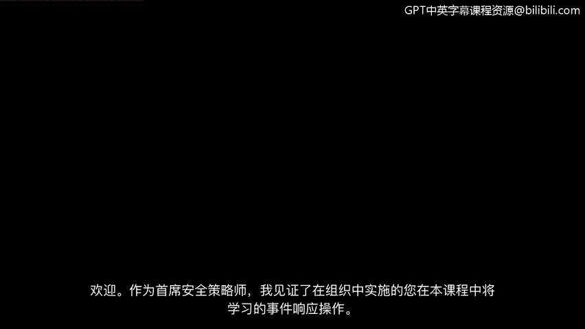
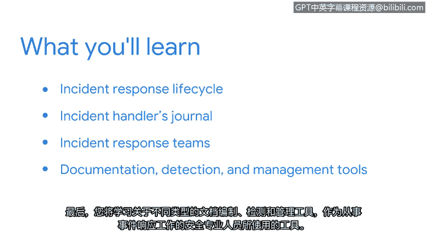

**谷歌网络安全专业证书第六课：《拉响警报：检测与响应》：1：欢迎来到第一周** 🚨

在本节课中，我们将开始学习网络安全事件检测与响应的核心知识。你将了解事件响应生命周期、相关团队角色以及安全专业人员使用的关键工具。

---

作为首席安全策略师，我亲眼见证了本课程将教授的事件响应操作在组织中的实施过程。

我发现检测和响应事件最令人兴奋的一点，是运用数据来理解攻击者在我方环境中行为的挑战。没有两次调查是完全相同的，但随着分析技能的磨练，你可以学会识别其中的行为模式。

上一节我们回顾了资产安全、威胁与漏洞的基础知识。我们探讨了将NIST网络安全框架作为风险管理的方法论，学习了通过资产分类与保护来降低组织风险，并研究了用于保护数据的安全与隐私控制措施。我们还使用了MITRE ATT&CK和CVE等工具来调查常见漏洞，并运用威胁建模等技术来培养攻击者思维。

本节中，我们将重新审视NIST网络安全框架，重点关注**事件响应生命周期**。你将获得自己的**事件处理者日志**，并在后续课程中持续使用它。

我们还将介绍事件响应团队，包括不同的团队角色及其如何组织起来响应事件。

最后，你将了解作为从事事件响应的安全专业人员，会使用到的各类文档、检测与管理工具。

以下是本课程将涉及的核心概念与工具概述：

*   **事件响应生命周期**：一个结构化的流程，用于管理安全事件，通常包含准备、检测与分析、遏制与根除、恢复以及事后总结等阶段。
*   **事件处理者日志**：用于记录调查步骤、发现和行动的关键文档。
*   **团队角色**：例如事件响应经理、安全分析师、取证专家等，各司其职。
*   **文档与工具**：包括事件报告、取证工具（如`Autopsy`或`FTK`）、安全信息与事件管理（SIEM）系统等。

后续课程中，你将有机会亲自使用这些工具。

你准备好开始检测与响应的学习之旅了吗？让我们开始吧。

---

本节课中，我们一起学习了事件响应的基本框架和准备工作。我们明确了事件响应生命周期的重要性，认识了事件处理者日志的作用，并概述了事件响应团队的角色与常用工具。这些知识为后续深入实践打下了坚实基础。