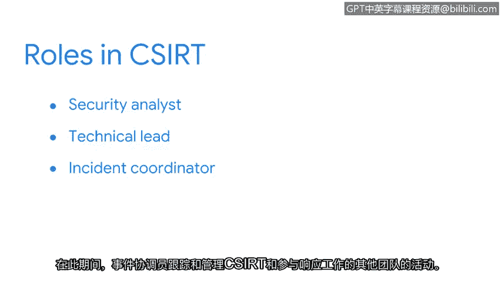

# 005：事件响应团队 🛡️

在本节中，我们将探讨事件响应团队如何管理安全事件。

## 概述
无论是体育团队、工作团队还是学校团队，团队的成功都依赖于成员们利用各自不同的优势，朝着共同的目标努力。事件响应团队也不例外。成功应对安全事件并非孤立进行，它需要一个由安全与非安全专业人员组成的团队，各司其职，协同工作。

## 什么是CSIRT？
计算机安全事件响应团队（CSIRT）是一组专门从事事件管理与响应的安全专业人员。其目标是**有效且高效地管理事件**，为响应和恢复提供服务和资源，并防止未来事件的发生。

## 跨部门协作
安全是共同的责任。因此，CSIRT必须与其他部门进行跨职能协作，共享相关信息。例如，如果一个事件导致了敏感数据（如财务文件或个人身份信息）的泄露，那么就必须咨询法务团队。某些法规遵从性措施可能要求组织在特定时间范围内公开披露安全事件。这意味着CSIRT必须与组织的公共关系团队合作，协调公开披露工作。

## CSIRT如何运作？
以下是CSIRT内部的关键角色及其职责：

*   **安全分析师**：负责调查安全警报，以确定是否发生了事件。如果检测到事件，分析师将确定事件的**关键性评级**。一些事件可以由安全分析师轻松补救，无需升级。
*   **技术负责人**：如果事件高度关键，则升级至技术负责人。技术负责人通过指导安全事件完成其生命周期来提供技术领导。
*   **事件协调员**：在此期间，事件协调员跟踪和管理CSIRT及其他参与响应工作的团队的活动。他们的职责是确保遵循事件响应流程，并定期向团队更新事件状态。

## 团队名称与结构差异
并非所有CSIRT都相同。根据组织情况，CSIRT也可能被称为**事件处理团队（IHT）** 或**安全事件响应团队（SIRT）**。

根据组织的结构，一些团队可能有更广泛或更专业化的侧重点。例如，有些团队可能专门负责危机管理，而另一些团队可能与安全运营中心（SOC）整合。

角色也可能有不同的名称。例如，技术负责人也可以被称为运营负责人。无论团队的名称或侧重点如何，它们都拥有共同的目标：**事件管理与响应**。

## 总结
本节我们一起学习了事件响应团队（CSIRT）的构成、跨部门协作的重要性以及团队内部的关键角色（安全分析师、技术负责人、事件协调员）。我们了解到，成功的事件响应依赖于一个定义清晰、协同工作的专业团队。

上一节我们介绍了事件响应团队，下一节我们将继续学习事件响应团队如何规划、组织和响应事件。