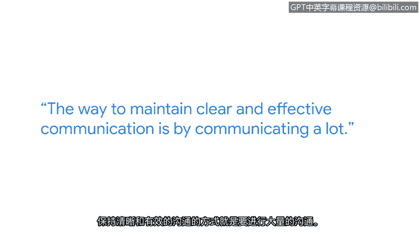

# 006：事件响应中的沟通艺术

## 概述
在本节课中，我们将跟随谷歌检测与响应团队的技术主管经理法蒂玛，学习在网络安全事件响应期间进行清晰有效沟通的重要性、具体方法以及团队协作的关键作用。

---

我的名字是法蒂玛，我是谷歌检测与响应团队的技术主管经理。如果网络上有黑客，我们的工作就是找到他们。

从事检测工作就像一位艺术家为演出做准备。我们花费大量时间开发各种特征签名来检测黑客。然后有一天，演出时刻到了。你会感受到同样的紧张感，并质疑自己是否已为演出做好准备。但你其实别无选择。黑客总会到来，你必须为他们做好准备。

我认为网络安全非常令人兴奋。你永远不知道下一个漏洞何时会被公开，也永远不知道下一次事件何时会发生。

2021年发生的Log4j漏洞就是一个重大事件的绝佳例子。整个公司团结起来，调查我们是否受到此漏洞的影响。做出这个判断是我团队的职责。我们每秒要处理数百万、数亿行的日志数据。在获取这些日志后，我们需要在其中进行搜寻和深度挖掘。

以下是处理此类事件的关键步骤：
*   创建不同的特征签名，与这些日志进行匹配，以寻找入侵迹象。
*   我们最终能够宣布：一切正常，我们未受影响，我们是安全的。

正是这些时刻，这些高光时刻，让一切努力都有了意义。

在事件响应场景中，团队合作是关键。你无法在没有一个非常稳固的团队的情况下运行事件响应。这个团队需要协作无间，并且彼此高度信任。

保持清晰有效沟通的方法就是进行大量沟通。在事件期间，这听起来可能有点违反直觉，但资深的工程师们会转变为运营负责人。他们的职责是确保其职能范围内的沟通不会中断。

因此，我们的角色从高度技术性转变为专注于沟通、汇总数据，并将数据呈现给需要了解的相关人员。

我强烈推荐网络安全作为一个职业领域。因为攻击者非常有创造力，他们不会让你感到无聊。所以我们寻找他们的方式也必须富有创造力。作为一个喜欢学习的人，知道总有一些新事物等待我去学习和精通，这令人兴奋，也让我保持动力。

---

## 总结
本节课中，我们一起学习了事件响应中沟通的核心价值。我们了解到，从日常的“排练”（开发检测签名）到“正式演出”（应对真实攻击），清晰的沟通和团队信任是成功响应的基石。资深成员在事件中需转变为沟通枢纽，确保信息流畅。网络安全领域充满挑战与学习机会，要求从业者保持创造力和持续学习的热情。