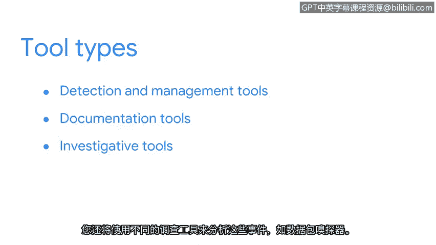

# 008：事件响应工具

在本节课中，我们将学习安全分析师在事件检测与响应过程中所使用的各类核心工具。你将了解到，就像工匠需要多种工具来完成工作一样，安全分析师也需要一个多样化的“工具箱”来有效监控、检测和分析安全事件。

## 安全分析师的核心角色 🛡️

作为一名安全分析师，你将在事件检测中扮演重要角色。你将身处前线，主动检测威胁。

为了完成这项工作，你不仅需要依赖目前已掌握的安全知识，还需要使用多种工具和技术来支持你的调查。

## 构建你的安全工具箱 🧰

一位优秀的木匠不会只用一把锤子来制作家具。他们会依赖工具箱里的各种工具来完成工作。他们需要使用卷尺测量尺寸，用锯子切割木材，用砂纸打磨表面。

同样，作为一名安全分析师，你也不会只用单一工具来监控、检测和分析事件。你将使用检测和管理工具来监控系统活动，以识别需要调查的事件。你将使用文档工具来收集和整理证据，并且还会使用不同的调查工具（例如数据包嗅探器）来分析这些事件。

## 工具的演进与持续学习 📈

新的安全技术不断涌现，威胁不断演变，攻击者也变得更加隐蔽以规避检测。

为了有效地检测威胁，你需要持续扩展你的安全工具箱。这也正是安全领域如此令人兴奋的原因——总有新的东西需要学习。

## 你的第一个工具：事件处理日志 📝

你可能还记得我们在上一节分享的“事件处理日志”。在本课程后续的学习中，你将把这份日志作为你自己的文档形式来使用。

请将此视为你添加到工具箱中的第一个安全工具。

---

**本节课总结**

本节课中，我们一起学习了安全分析师在事件响应中扮演的角色，并认识了构建一个多样化安全工具箱的重要性。我们了解到，从监控工具到文档工具，再到分析工具，每一种工具都有其特定用途。最后，我们引入了“事件处理日志”作为你实践中的第一个关键工具。掌握并熟练运用这些工具，是你成为有效安全分析师的第一步。