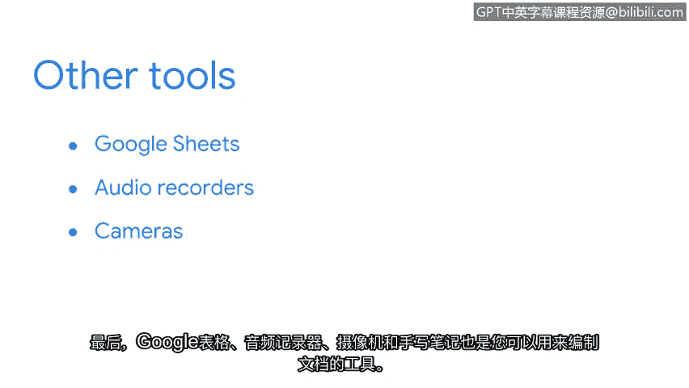

# 009：文档的价值 📄

在本节课中，我们将要学习文档在网络安全事件处理中的核心价值。我们将探讨不同类型的文档、有效文档的重要性，以及一些实用的文档工具。

## 文档的定义与类型

上一节我们介绍了事件处理者日志的用途。本节中，我们来看看文档的广义定义及其常见类型。

文档是为特定目的而记录的任何形式的内容。这包括音频、数字或手写说明，甚至视频。行业中没有统一的文档标准，因此许多组织会制定自己的文档实践。无论如何，文档旨在为特定主题提供指导和说明。

文档有多种类型，其中一些你可能在之前的课程中已经熟悉。以下是常见的文档类型：

*   **预案手册**：提供任何操作行动细节的手册。
*   **事件处理者日志**：用于记录事件“五要素”（何人、何事、何地、何时、为何）的日志。
*   **政策**：规定组织行为准则的正式文件。
*   **计划**：为实现特定目标而制定的详细步骤。
*   **最终报告**：总结事件处理过程和结果的报告。

由于没有行业标准，一个组织的文档实践可能与另一个组织完全不同。组织通常会根据自身需求和法律要求来定制其文档实践，可能会增加、删除甚至合并文档类型。

## 有效文档的重要性

理解了文档的类型后，我们来看看为什么制作有效的文档至关重要。

你是否曾因不知如何使用某个产品而查阅产品手册，以获取诸如如何开机等操作的说明？恭喜你，你已经通过使用文档解决了问题。同样，在事件响应中，预案手册能保障业务操作安全。预案手册的工作原理类似于产品手册。作为复习，**预案手册**是提供任何操作行动细节的手册。我们将在后续课程中更深入地了解预案手册。

让我们回到产品手册的例子。你是否曾因寻求帮助而查阅产品手册，却发现说明令人困惑，无法获得所需的帮助？无论是由于不清晰的视觉指示、说明，还是混乱的布局，你都无法利用文档解决问题。这就是**无效文档**的例子。

**有效文档**能减少不确定性和困惑。这在安全事件期间至关重要，因为当时气氛紧张且需要紧急响应。作为一名安全专业人员，你将经常使用和创建文档。确保你使用和制作的文档清晰、一致且准确，是至关重要的，这样你和你的团队才能迅速、果断地做出响应。

## 文档工具简介

了解了有效文档的原则后，我们来看看有哪些工具可以帮助我们进行记录。

文字处理器是记录文档的常用方式。一些流行的工具包括：`Google Docs`、`OneNote`、`Evernote` 和 `Notepad++`。像 `JIRA` 这样的工单系统也可用于记录和跟踪事件。最后，`Google Sheets`、录音设备、摄像机和手写笔记也是你可以用来记录的工具。

---

本节课中我们一起学习了文档在网络安全中的核心价值，包括其定义、不同类型（如预案手册和日志），以及制作有效文档的重要性。我们还简要介绍了一些实用的文档工具。关于文档的讨论才刚刚开始，很快你将使用你的事件处理者日志来实践你的文档技能。