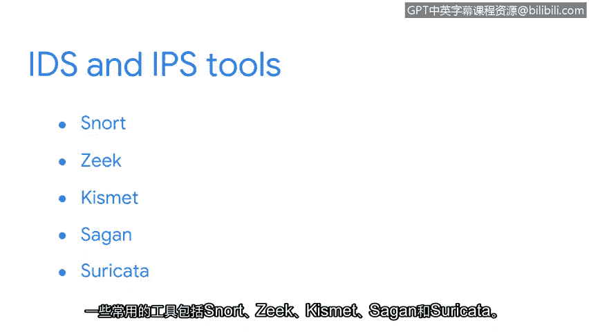

# 010：入侵检测系统 🚨

在本节课中，我们将学习入侵检测系统（IDS）和入侵预防系统（IPS）的基本概念、工作原理以及它们在网络安全中的作用。

---

想象一下，你刚刚在家里安装了一套入侵安全系统。你在家中的每个出入口，包括门和窗户，都安装了入侵传感器。这些传感器通过发出声波来工作。当有物体触碰到声波时，声波会反射回传感器，并向你的手机触发警报，通知你检测到入侵。

入侵检测系统（IDS）的工作原理与家庭入侵传感器非常相似。入侵检测系统是一种监控系统和网络活动，并对可能的入侵发出警报的应用程序。与家庭入侵传感器一样，IDS收集并分析系统信息以发现异常活动。如果检测到异常情况，IDS会向适当的渠道和人员发送警报。

现在，想象一家珠宝店的橱窗上装有窗户传感器。当传感器检测到窗户玻璃被打碎时，它会触发一个钢制卷帘门自动升起，替换被打碎的窗户，以防止未经授权进入商店。这就是入侵预防系统（IPS）的功能。入侵预防系统拥有与IDS相同的所有能力，但它还能做得更多：它监控系统活动以发现入侵，并采取行动阻止入侵。

许多工具能够同时执行IDS和IPS的功能。一些流行的工具包括：**Snort**、**Zeek**、**Kismet**、**SEON** 和 **Suricata**。我们将在后续课程中探索Suricata。

你可能会好奇这些警报通知会发送到哪里。接下来，我们将讨论如何使用安全信息和事件管理工具来管理警报。

---

本节课中，我们一起学习了入侵检测系统（IDS）和入侵预防系统（IPS）的核心概念。我们了解到，IDS负责监控和发出警报，而IPS在此基础上还能主动采取措施阻止入侵。我们还介绍了几种常见的相关工具，并预告了后续课程将深入探讨的Suricata以及警报管理工具。