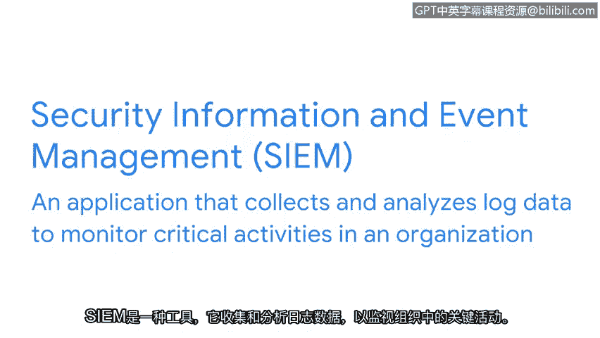
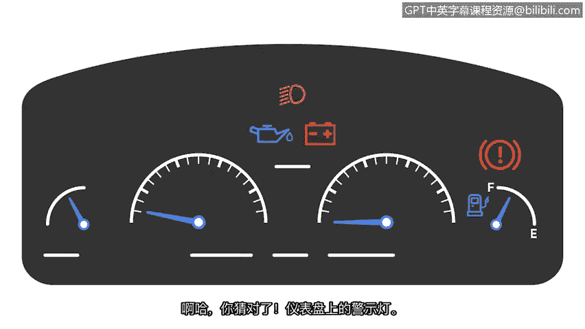
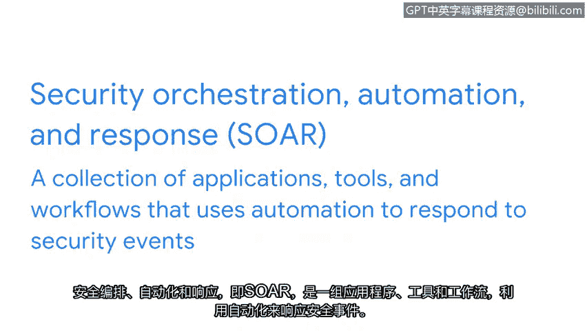

**谷歌网络安全专业证书第六课：6：使用SIEM和SOAR工具进行警报和事件管理** 🚨

在本节课中，我们将要学习两种关键的网络安全工具：安全信息与事件管理（SIEM）和安全性编排、自动化与响应（SOAR）。我们将了解它们如何帮助安全分析师收集、分析数据并高效响应安全事件。

---

上一节我们讨论了各种检测工具，你可能会好奇警报被发送到哪里以及安全分析师如何访问这些警报。本节中我们来看看SIEM工具如何解决这个问题。

SIEM是一种收集和分析日志数据以监控组织关键活动的工具。它为安全专业人员提供了其网络活动的高级概览。

那么，它具体是如何做到的呢？让我们用一个汽车的比喻来解释。汽车有许多不同的部件，如轮胎、车灯，当然还有引擎盖下的所有内部机械装置。汽车的组件繁多，但你如何知道其中一个出了问题呢？答案是仪表盘上的警告灯。仪表盘会通知你与汽车部件相关的信息，无论是胎压过低、电池电压不足、需要加油，还是车门未关好。

汽车的仪表盘通过通知你各部件的状态，让你可以采取行动进行修复。SIEM工具的工作方式与此类似。正如汽车有许多组件一样，一个网络可能拥有成千上万不同的设备和系统，这使得监控它们成为一项挑战。汽车的仪表盘为驾驶员提供了清晰的车辆状态视图，使他们无需亲自检查每个部件。同样地，SIEM会查看网络中所有不同系统之间的数据流，并对其进行分析，以提供网络潜在威胁的实时视图。

它通过**摄取海量数据**并**对这些数据进行分类**来实现这一点，从而使其能够通过一个类似汽车仪表盘的集中式平台轻松访问。

以下是SIEM的工作流程：

首先，SIEM工具**收集和聚合数据**。这些数据通常以日志的形式存在，日志基本上是记录给定源上发生的所有事件。数据可以来自多个来源，例如入侵检测系统（IDS）、入侵防御系统（IPS）、数据库、防火墙、应用程序等。

在所有数据被收集之后，它们会被**聚合**。聚合简单来说就是将来自不同数据源的所有数据集中到一个地方。根据SIEM收集的数据源数量，可能会收集到大量原始的、未经编辑的数据，并且并非SIEM收集的所有数据都与安全分析目的相关。

接下来，SIEM工具**规范化数据**。规范化处理SIEM收集的原始数据，通过移除非必要的属性来清理数据，只保留相关部分。数据规范化还能在日志记录中创建一致性，这在事件调查期间搜索特定日志信息时非常有帮助。

最后，规范化后的数据会根据配置的规则进行**分析**。SIEM根据规则集分析规范化数据，以检测任何可能的安全事件，这些事件随后会被分类或报告为警报，供安全分析师审查。

---

现在你已经探索了SIEM工具的功能，让我们来研究另一种安全管理工具：安全性编排、自动化与响应（SOAR）。

SOAR是一个应用程序、工具和工作流程的集合，它利用自动化来响应安全事件。

虽然SIEM工具为安全分析师收集、分析和报告安全事件以供审查，但**SOAR则自动化了安全事件和事故的分析与响应**。

SOAR还可用于**跟踪和管理案例**。多个事件可以构成一个案例，SOAR提供了一种在一个集中位置查看所有这些事件的方法。

---

本节课中我们一起学习了SIEM和SOAR这两种事件管理工具。SIEM如同网络的“仪表盘”，负责收集、规范化和分析日志数据以生成警报。而SOAR则在此基础上更进一步，通过自动化工作流程来帮助安全分析师高效响应和管理安全事件与案例。理解这两种工具如何协同工作，对于构建有效的安全监控和响应能力至关重要。