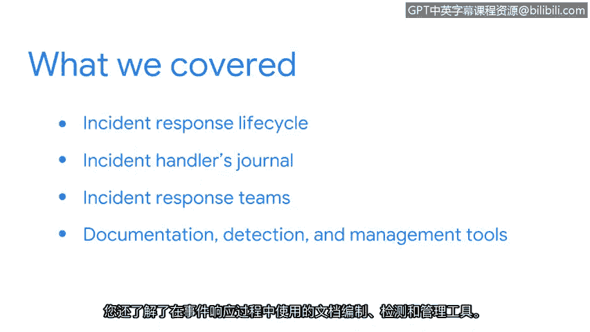

# 012：检测与响应总结

在本节课中，我们学习了网络安全事件响应的核心框架与工具，为后续的实践操作奠定了基础。

## 课程概述

我们首先介绍了**事件响应生命周期**，这是一个用于支持事件响应流程的框架。你还获得了自己的**事件处理日志**，用于记录事件调查过程，并将在本课程后续部分持续使用。

## 核心内容回顾

上一节我们介绍了事件响应的基本框架，本节中我们来回顾一下具体的学习要点。

以下是本部分课程涵盖的关键主题：

*   **事件响应生命周期**：学习了作为事件响应流程支撑框架的各个阶段。
*   **事件处理日志**：获得了用于记录和追踪事件调查过程的个人工具。
*   **团队协作与计划**：探讨了事件响应团队如何依据事件计划协同工作以应对安全事件。
*   **响应工具**：了解了在事件响应过程中使用的文档、检测和管理工具。

## 总结与展望

本节课中我们一起学习了事件响应的基础概念、团队协作模式以及常用工具。恭喜你完成了事件响应学习之旅的第一部分。

接下来，我们将深入探讨**网络监控**。你也将有机会通过实践活动来应用所学的知识。我们下一节再见。😊