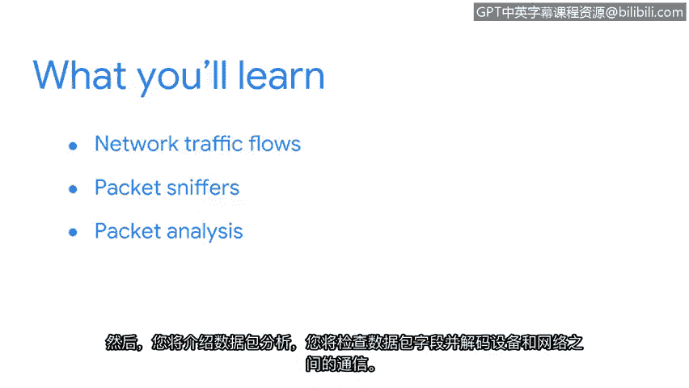

# 013：欢迎来到第二周 🚀

在本节课中，我们将深入学习网络分析。我们将从回顾网络通信基础开始，逐步探索网络流量、数据包嗅探器以及数据包分析技术，这些技能对于检测和响应安全事件至关重要。

## 回顾与引入

上一节我们介绍了事件检测与响应的基本概念。你可能还记得在之前的课程中学习过网络知识。简单回顾一下，你学习了设备如何使用**网络协议**进行通信，以及不同类型的网络攻击。你也研究了一些网络安全最佳实践。

本节中，我们将在此基础上扩展，将重点转向**网络分析**。

## 本周学习内容概览

以下是本周我们将要探索的核心主题：

首先，你将通过探索**网络流量**来检查网络通信。

接下来，你将学习如何使用**数据包嗅探器**来查看和捕获网络流量。

然后，你将初步接触**数据包分析**，在此过程中，你将检查数据包字段并解码设备与网络之间的通信。

## 技能培养目标

作为一名安全专业人员，你的任务将是监控网络和系统基础设施，以检测恶意活动。

本部分内容将为你提供机会，培养你的网络和数据包分析技能。

你准备好开始了吗？让我们正式启程。😊