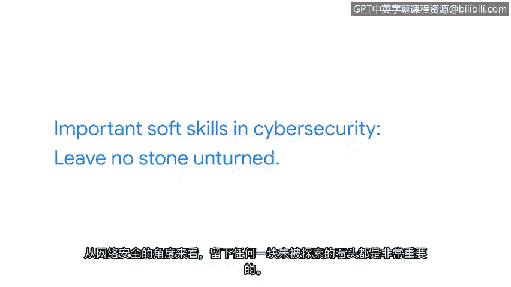

**网络安全专业证书课程：第六课：拉响警报：检测与响应**

**P14：13_凯西：在网络安全中应用软技能**

---

### **概述**
在本节课程中，我们将跟随谷歌云企业安全销售团队的凯西，学习软技能在网络安全领域中的关键作用。我们将了解为什么清晰的沟通和开放的心态对于应对不断变化的网络威胁至关重要。

---

大家好，我是凯西，来自谷歌云企业安全销售团队。

首先，我能给出的最重要建议是：行动起来。我希望你们能加入这个领域。我们需要各种各样的人才。网络安全世界永不停歇、不断变化，这正是它充满魅力的原因。

我们需要安全领域更具多样性。我们需要每个人的参与。我们需要拥有不同思维、不同背景、不同视角的人才。

---

### **核心软技能一：清晰沟通**
上一部分我们提到了参与的重要性，接下来我们看看具体需要哪些软技能。我认为，网络安全中最重要的软技能之一，是能够清晰地总结你想要表达的内容。这一点极其重要。

其核心在于将复杂的技术问题转化为易于理解的语言。例如，在报告安全事件时，不应只说“系统检测到异常流量”，而应总结为：“**我们的Web服务器在下午3点遭受了来自IP地址X.X.X.X的DDoS攻击，导致服务中断了10分钟，现已缓解。**”

---

### **核心软技能二：开放心态**
然而，我认为另一项软技能可能比清晰沟通更为重要，那就是以开放的心态进行工作。

因为网络威胁态势在不断变化。威胁行为者、恶意攻击者从不休息。因此，我们也不能停止学习和适应。

在我看来，网络安全之所以充满乐趣，正是因为它持续变化。如果我们带着固定思维进入这个领域——所谓固定思维，是指“我认为我知道答案”、“我认为我完全了解情况”——那么我们绝对会错失良机。

我们需要始终保持好奇心。从网络安全的角度来看，**彻底调查、不留死角**至关重要。

---

### **你已经拥有这些技能**
关于软技能最棒的一点是，我们都已拥有它们，并且每天都在使用。所以，每一位观看本视频的观众，在网络安全领域都已经拥有了先发优势。

---

### **总结**
本节课中，我们一起学习了网络安全从业者必备的两项核心软技能：**清晰的沟通能力**与**开放的成长型心态**。网络安全领域变化迅速，需要多样化的思维和持续的好奇心。请记住，你已经具备这些软技能的基础，下一步就是勇敢地付诸实践，加入这个充满挑战与机遇的领域。