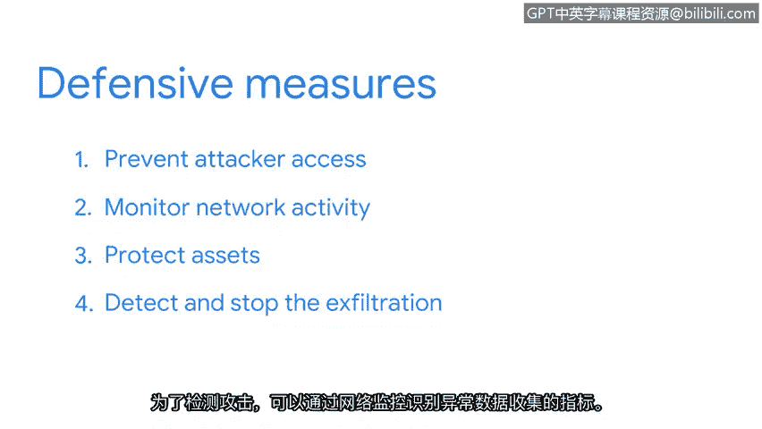

# 016：数据外泄攻击 🚨

在本节课中，我们将学习数据外泄攻击的全过程，包括攻击者如何实施攻击以及安全团队如何检测和响应此类威胁。我们将从攻击者和防御者两个视角来剖析这一常见的网络安全事件。

## 概述

监控网络流量是安全专业人员检测、预防和响应攻击的关键手段。即使信息被加密，监控网络流量对于安全目的仍然至关重要。通过识别与典型网络流量模式的偏差，安全团队能够取得显著成果。

## 攻击者视角

首先，让我们从攻击者的视角来理解数据外泄攻击的步骤。在攻击者能够执行数据外泄之前，他们需要先获得对网络和计算机系统的初始访问权限。

以下是攻击者通常采取的步骤：

1.  **初始访问**：攻击者通常通过网络钓鱼等社会工程学攻击来达成此目的。这类攻击通过欺骗人们泄露敏感数据来实施。攻击者会发送带有附件或链接的钓鱼邮件，诱骗目标输入其凭据。
2.  **横向移动**：成功获得设备访问权限后，攻击者不会就此止步。他们的目标是在环境中维持访问权限，并尽可能长时间地避免被检测到。为此，他们会执行一种称为“横向移动”或“跳转”的策略。这意味着他们会花时间探索网络，目标是扩大并维持其对网络上其他系统的访问权限。
3.  **识别资产**：在横向移动过程中，攻击者会侦察环境，以识别有价值的资产。这些资产包括敏感数据，如专有信息、个人身份信息（如姓名和地址）或财务记录。他们通过搜索网络文件共享、内联网站点、代码仓库等位置来完成此步骤。
4.  **准备数据**：识别出有价值的资产后，攻击者需要收集、打包数据，并为其从组织网络外泄到攻击者手中做好准备。他们可能会通过压缩等方式减少数据大小，这有助于隐藏被盗数据并绕过安全控制。
5.  **外泄数据**：最后，攻击者将数据外泄到他们选择的目的地。方法有很多，例如，攻击者可以使用被入侵的电子邮件账户将窃取的数据通过邮件发送给自己。

## 防御者视角

现在，我们已经了解了攻击者的思路，接下来让我们探讨组织如何防御此类攻击。

上一节我们介绍了攻击者的攻击流程，本节中我们来看看安全团队如何构建防线。首先，安全团队必须阻止攻击者获得访问权限。

以下是组织可以采取的防御措施：

1.  **预防访问**：可以采用多种方法来保护网络免受钓鱼攻击。例如，要求用户使用**多因素认证**。
2.  **监控活动**：获得网络访问权限的攻击者可能会潜伏一段时间而不被发现。因此，安全团队监控网络活动以识别可能表明系统已遭入侵的可疑活动至关重要。例如，应调查来自网络外部IP地址的多次用户登录尝试。
3.  **保护资产**：之前，我们学习了如何使用资产清单和安全控制来识别、分类和保护资产。作为组织安全策略的一部分，所有资产都应在资产清单中编目。同时，应应用适当的安全控制措施来保护这些资产免遭未经授权的访问。
4.  **检测与响应**：如果数据外泄攻击成功，安全团队必须检测并阻止数据外泄。为了检测攻击，可以通过网络监控识别异常数据收集的指标。这些指标包括：
    *   大量的内部文件传输。
    *   大量的外部上传。
    *   意外的文件权限变更。

**SIEM**（安全信息与事件管理）工具可以检测这些活动并发出警报。一旦警报发出，安全团队就会展开调查并阻止攻击继续。阻止此类攻击的方法有很多。例如，一旦识别出异常活动，就可以使用防火墙规则**阻止与攻击者关联的IP地址**。

## 总结

本节课中，我们一起学习了数据外泄攻击的完整生命周期。我们从攻击者如何通过初始访问、横向移动、识别资产、准备数据到最终外泄数据的步骤进行了分析。同时，我们也探讨了防御方如何通过预防访问、持续监控、保护资产以及利用工具检测和响应来构建有效的安全防线。数据外泄攻击只是众多可通过网络监控检测到的攻击之一，在接下来的课程中，你将学习如何使用数据包嗅探器来监控和分析网络通信。