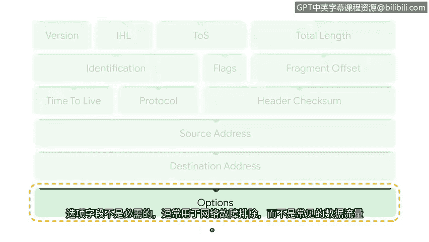

# 019：深入解析IP数据包头字段 🔍

在本节课中，我们将学习如何手动分析和解读网络数据包的核心组成部分——IP数据包头。这对于安全分析师理解网络通信的本质至关重要。

虽然有许多现成的工具可以使用，但作为一名安全分析师，学会如何手动读取和分析数据包至关重要。为此，让我们来研究一个重要的数据包组件：IP包头。

## 回顾TCP/IP模型

上一节我们介绍了TCP/IP模型的基本框架。TCP/IP模型是一个用于可视化数据如何在网络上组织和传输的框架。互联网层负责接收和传递网络数据包，也是互联网协议（IP）运作的层面，它是所有互联网通信的基础，确保数据包能够到达目的地。

## 理解IP协议的作用

互联网协议的工作方式类似于邮递员投递信件。它不使用信封上的投递信息，而是使用数据包头中的信息（如IP地址），然后确定数据包传输的最佳可用路径，以便在主机之间发送和接收数据。

## 数据包头与协议版本

正如你所知，IP数据包包含包头。包头包含了将数据传输到其预期目的地所必需的数据字段。不同的协议使用不同的包头。互联网协议有两个不同的版本：**IPv4**（被认为是互联网通信的基础）和**IPv6**（互联网协议的最新版本）。不同协议使用不同的包头，因此IPv4和IPv6的包头有所不同，但它们包含名称不同但功能相似的字段。目前IPv4仍然是使用最广泛的，因此我们将重点研究IPv4包头的字段。

以下是IPv4数据包头的主要字段及其功能：

*   **版本**：此字段指定所使用的IP版本，是IPv4还是IPv6。可以类比为邮件的不同类别，如优先、特快或平邮。
*   **首部长度**：此字段指定IP头部的长度加上任何选项的长度。
*   **服务类型**：此字段告诉我们某些数据包是否应被区别对待。可以类比为邮寄包裹上的“易碎”标签。
*   **总长度**：此字段标识整个数据包（包括头部和数据）的长度。可以类比为信封的尺寸和重量。
*   **标识、标志、片偏移**：这三个字段处理与**分片**相关的信息。分片是指一个IP数据包被分解成多个块，通过线路传输，并在到达目的地时重新组装。这些字段指定是否使用了分片以及如何按正确顺序重新组装被分解的数据包。这类似于邮件在到达目的地前可能经过多个路径（如邮箱、处理设施、飞机和邮车）。
*   **生存时间**：顾名思义，此字段决定数据包在被丢弃之前可以存活多长时间。没有这个字段，数据包可能会在路由器之间无限循环。TTL类似于跟踪信息提供信封预期送达日期的细节。
*   **协议**：此字段通过提供一个对应特定协议的值来指定所使用的协议。例如，TCP用数字`6`表示。这类似于在邮政地址中包含门牌号。
*   **首部校验和**：此字段存储一个称为校验和的值，用于确定头部是否发生了任何错误。
*   **源地址**：指定源IP地址。
*   **目的地址**：指定目的IP地址。这就像信封上的发件人和收件人联系信息。
*   **选项**：此字段不是必需的，通常用于网络故障排除，而非普通流量。如果使用此字段，头部长度会增加。这就像为信封购买邮政保险。

最后，在数据包头的末尾是数据包的数据所在位置，就像电子邮件中的正文一样。

## 总结

本节课中，我们一起深入学习了IPv4数据包头的各个关键字段及其功能。从版本标识到地址信息，再到控制传输的生存时间和分片字段，每个部分都像邮件系统中的元素一样，共同协作以确保数据能够准确、可靠地穿越网络到达目的地。理解这些基础字段是手动分析网络流量、诊断问题以及识别潜在安全威胁的重要第一步。