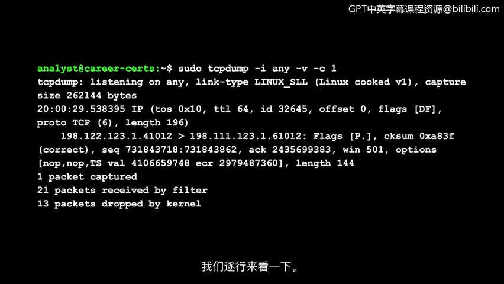
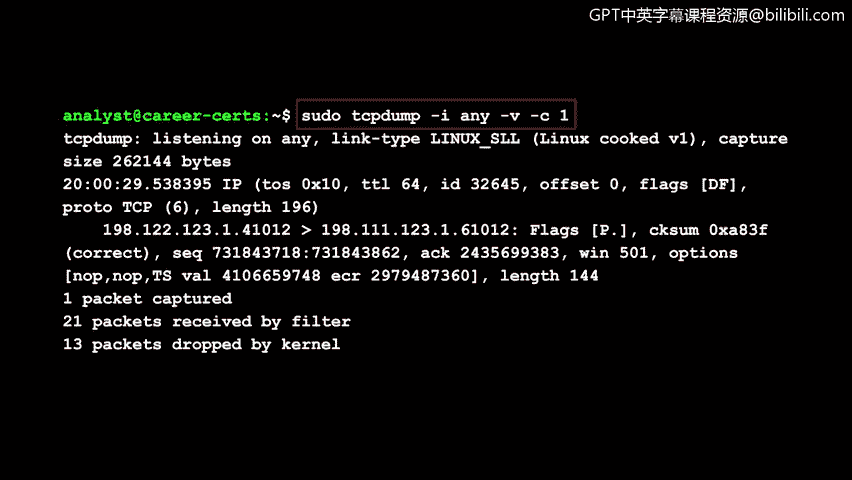
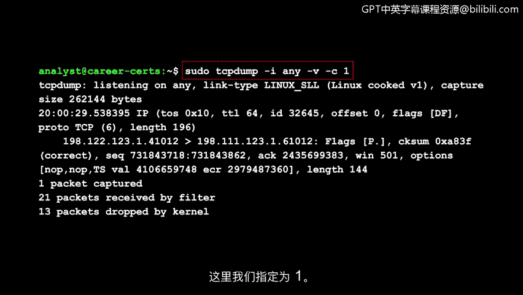
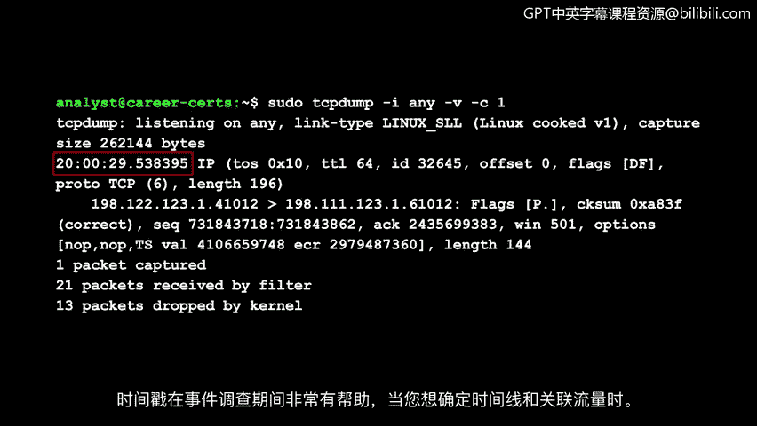
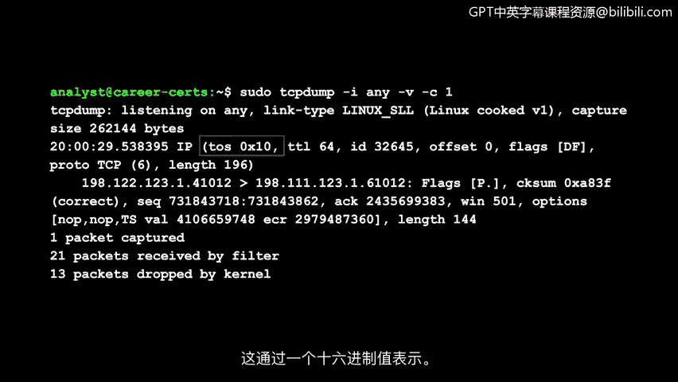
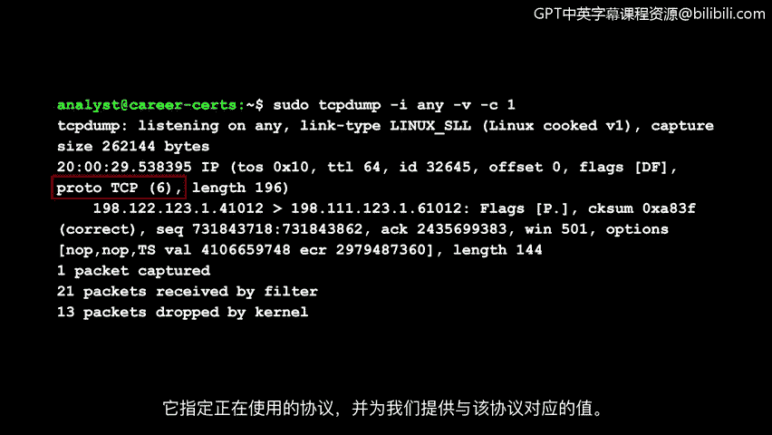
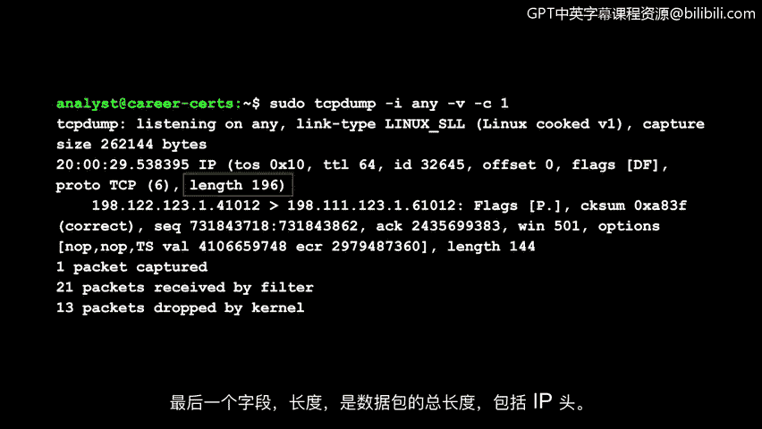
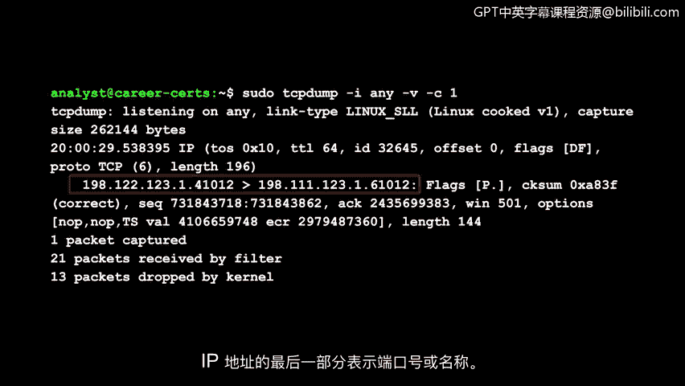
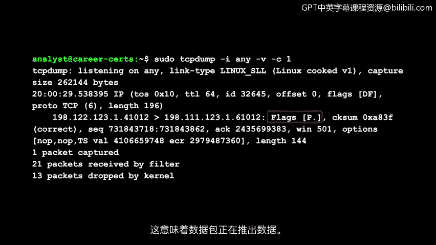

# 020：使用tcpdump进行数据包捕获 🕵️

在本节课中，我们将要学习如何使用一个强大的命令行网络分析工具——`tcpdump`。我们将了解它的基本用法、如何解读其输出，以及如何利用它来捕获和分析网络数据包。

---

## 概述 📋

`tcpdump` 是一个流行的网络分析器。它预装在许多 Linux 发行版上，也可以安装在大多数类 Unix 操作系统上，例如 macOS。你可以使用它轻松捕获和监控网络流量，例如 TCP、IP、ICMP 等协议的数据包。

`tcpdump` 是一个命令行工具，这意味着它没有图形用户界面。在本课程的前期，你已经了解到命令行是一个非常强大且高效的工具。现在，我们将结合 `tcpdump` 来实践使用它。

你可以通过为命令应用选项和标志来轻松过滤网络流量，从而精确地找到你想要的信息。例如，你可以过滤特定的 IP 地址、协议或端口号。

---

## 一个简单的tcpdump命令示例 🔍

让我们来检查一个用于捕获数据包的简单 `tcpdump` 命令。请注意，当你使用此命令时，你计算机上的流量显示可能会有所不同。

乍一看，输出信息可能显得非常多。让我们逐行分析它。

我们运行的命令是：`sudo tcpdump -i any -v -c 1`。

我们使用 `sudo` 是因为我们当前登录的 Linux 账户没有运行 `tcpdump` 的权限。

然后，我们指定 `tcpdump` 来启动程序，`-i` 选项用于指定我们想要嗅探流量的网络接口（这里使用 `any` 表示所有可用接口）。`-v` 代表详细模式，它会显示详细的数据包信息。`-c` 代表计数，它指定 `tcpdump` 将捕获多少个数据包。

在这里，我们指定了 `1`，即只捕获一个数据包。现在，让我们来检查输出。

---

## 解读tcpdump输出 📄

`tcpdump` 告诉我们，它正在监听所有可用的网络接口。它还提供了附加信息，例如捕获数据包的大小。

第一个字段是数据包的时间戳，它详细说明了数据包传输的具体时间。它以小时、分钟、秒和秒的小数部分开始。

时间戳在事件调查中特别有用，当你想要确定时间线并关联流量时。

接下来，`IP` 被列为版本字段。这里显示为 `IP`，意味着它是 IPv4。

详细选项 `-v` 为我们提供了关于 IP 数据包字段的更多细节，例如协议类型和数据包长度。让我们仔细看看。

第一个字段 `TOS` 代表服务类型。回想一下，这个字段告诉我们某些数据包是否应该被区别对待。它由一个十六进制值表示。

`TTL` 字段是生存时间，它告诉我们一个数据包在网络中被丢弃前可以传输多久。

接下来的三个字段是标识、偏移量和标志，它们提供了与数据包分片相关的信息。这些字段提供了如何按正确顺序重组数据包的指令。例如，标志旁边的 `DF` 代表“不分片”。

接下来，`proto` 是协议字段。它指定了正在使用的协议，并提供了与该协议对应的值。在这里，协议是 TCP，由数字 `6` 表示。

最后一个字段 `length` 是数据包的总长度，包括 IP 头。

---

## 分析通信与TCP信息 🔄

接下来，我们可以观察到正在相互通信的 IP 地址。箭头的方向指示了流量的方向。IP 地址的最后一部分指示了端口号或名称。

接下来，`cksum` 或校验和字段对应头部校验和，它存储了一个用于确定头部是否发生错误的值。在这里，它告诉我们校验正确，没有错误。

剩余的字段与 TCP 相关。例如，`Flags` 指示 TCP 标志。`P` 是推送标志，而句点表示这是一个确认标志。这意味着该数据包正在推送数据。

这只是你可以在 `tcpdump` 中使用的众多命令之一，用于捕获网络流量。观察这些无形数据包中包含的所有信息，是不是很吸引人？请亲自尝试一下。

---

## 总结 ✨

本节课中，我们一起学习了 `tcpdump` 的基本使用方法。我们了解了如何通过 `sudo tcpdump -i any -v -c 1` 这样的命令捕获单个数据包，并详细解读了输出结果中的各个字段，包括时间戳、IP版本、服务类型、生存时间、协议类型以及TCP标志等。掌握 `tcpdump` 是进行网络流量分析和安全事件调查的重要基础技能。