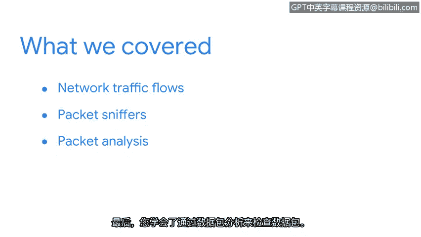

# 021：检测与响应

## 概述
在本节课中，我们将回顾并总结网络流量分析与数据包检查的核心技能。这些技能对于识别安全威胁和进行事件响应至关重要。

## 课程总结 🎯

到目前为止，你的表现非常出色。祝贺你成功捕获并分析了第一个数据包。

让我们回顾一下目前已涵盖的内容。

首先，你学习了网络流量如何提供有价值的通信洞察。这是通过监控网络活动以寻找入侵指标来实现的。

接着，你学习了如何发现异常的网络活动，例如**数据渗漏**。

然后，你学习了如何使用**数据包嗅探器**来查看和捕获网络流量。

最后，你学习了如何通过**数据包分析**来检查数据包。你剖析了数据包头部的数据字段，并详细分析了数据包捕获文件。

你在培养入门级安全职位所需技能方面取得了巨大进展。

## 后续展望 🔮

在接下来的课程中，你将深入激动人心的事件调查世界。你将研究检测和遏制安全事件背后的流程。

我们下一课再见。😊