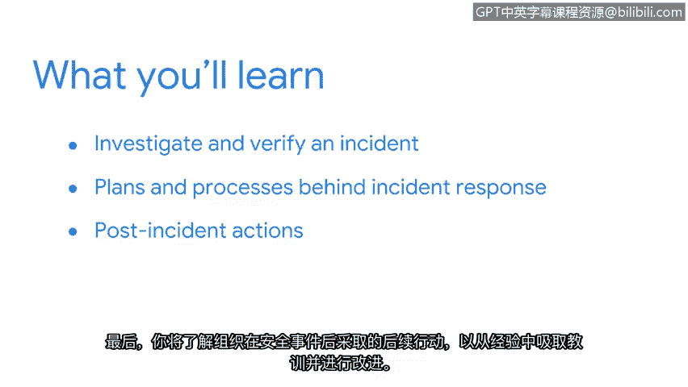

# 022：欢迎来到第三周 🚨

在本节课中，我们将要学习安全事件从发生到结束的完整生命周期。我们将重点关注如何检测、响应安全事件，并从事件中恢复。通过本节内容，你将获得对事件生命周期的全面理解。

欢迎回来。大家目前的学习成果非常出色。

你们正在学习的技能将为开启安全职业生涯奠定坚实的基础。

## 从网络分析到事件响应

上一节中，我们应用了网络知识来加深对网络流量的理解。我们练习了安全分析师在工作中使用的一些技能，例如捕获网络流量和分析数据包。

接下来，我们将从头到尾地审视一个安全事件的生命周期。

## 本节核心学习目标

我们将聚焦于如何在检测到事件后进行事件调查与核实。以下是本节将要探讨的主要内容：

*   **调查与核实**：学习如何调查和验证一个已被检测到的事件。
*   **响应计划与流程**：探索事件响应背后的计划和流程。
*   **事后行动**：了解组织为从事件中学习并改进而采取的后续行动。

在本节结束时，你将全面掌握一个安全事件的完整生命周期。

你已经准备就绪。让我们开始吧。