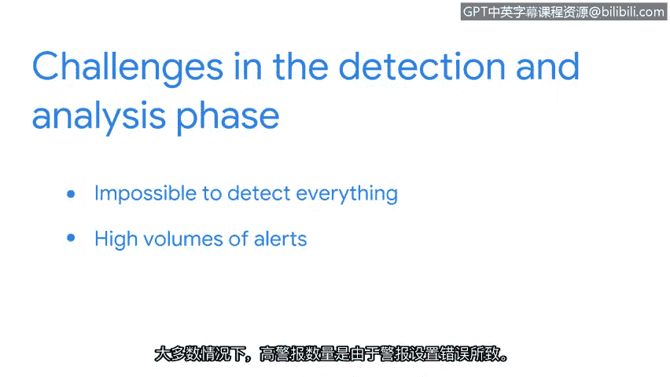

# 023：检测与响应

## 概述
在本节课中，我们将要学习安全事件响应生命周期中的检测与分析阶段。你将了解安全事件如何被发现、如何被分析验证，以及安全分析师在此过程中面临的挑战与所需技能。

---

## 检测与分析阶段详解

上一节我们介绍了事件响应生命周期的整体框架，本节中我们来看看其核心阶段之一：检测与分析。

安全事件总会发生。作为一名安全分析师，在你的职业生涯中，很可能需要在某个时刻负责调查和响应安全事件。

检测与分析是事件响应团队验证和分析事件的阶段。

检测能够及时发现安全事件。需要记住，并非所有事件都是安全事件，但所有安全事件都属于事件。事件是业务运营中的常规活动，例如访问网站或密码重置请求。

入侵检测系统（IDS）和安全信息与事件管理（SIEM）工具会从不同来源收集并分析事件数据，以识别潜在的非正常活动。

如果检测到事件，例如恶意行为者成功获得了对某个账户的未授权访问，系统就会发出警报。随后，安全团队开始进行分析阶段。

分析阶段涉及对警报的调查与验证。在此过程中，分析师必须运用批判性思维和事件分析技能来调查和验证警报。他们会检查入侵指标，以确定是否确实发生了安全事件。

这可能会面临一些挑战。检测的挑战在于，不可能检测到所有事情。即使优秀的检测工具，其工作方式也存在局限性。并且，由于资源有限，自动化工具可能无法在组织内部完全部署。

有些事件是不可避免的，这就是为什么组织制定事件响应计划非常重要。

分析师在每个班次通常会收到大量警报，有时甚至成千上万。大多数时候，高警报量是由警报设置配置不当引起的。例如，过于宽泛且未根据组织环境进行调整的警报规则会产生误报。

其他时候，高警报量也可能是由恶意行为者利用新发现的漏洞所引发的真实警报。

作为一名安全分析师，具备有效分析警报的能力至关重要。接下来，你将学习如何做到这一点。

---

## 总结
本节课中我们一起学习了事件响应生命周期的检测与分析阶段。我们明确了事件与安全事件的区别，了解了IDS和SIEM工具在检测中的作用，并探讨了分析师在验证警报、处理高警报量以及区分误报与真实威胁时所面临的挑战与所需技能。