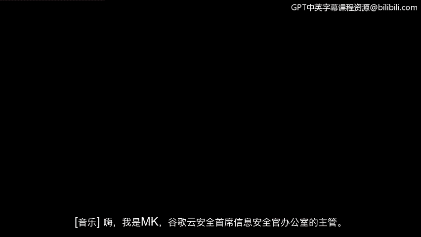
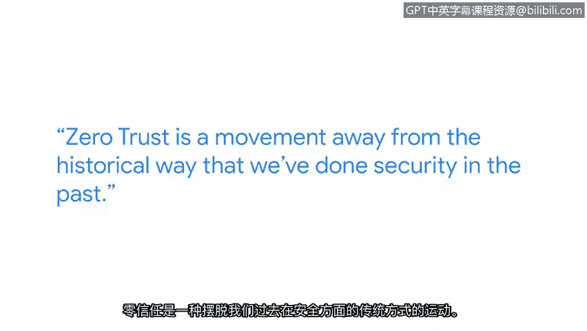

# 024：网络安全行业的变化 🛡️

在本节课中，我们将跟随谷歌云首席信息安全官办公室总监马克的分享，了解网络安全行业的动态与挑战，特别是零信任架构的兴起及其重要性。

## 概述

网络安全是一个持续演变的领域。本节内容将探讨行业现状、面临的挑战以及未来的发展趋势，重点分析零信任模型如何改变传统的安全范式。

## 行业现状与挑战

上一节我们探讨了网络安全的基础，本节中我们来看看行业面临的现实挑战。马克指出，当前行业普遍缺乏攻击者所具备的那种敏捷性。

*   攻击者一旦发现有效方法，便会持续使用，直到遇到阻碍。
*   当阻碍出现时，他们能迅速调整战术和技术，以绕过障碍，在未来的攻击中再次尝试入侵。

因此，我们无法预测未来，网络安全也远未达到最终形态。这是一个持续演进的行业。

## 应对策略：敏捷与准备

鉴于攻击的持续性和多变性，防御方需要采取相应的策略来应对。

*   我们必须做好多方面的准备，以应对攻击者必然发起的持续攻击。
*   这要求我们具备一定的敏捷性。你需要适应在未知环境中工作。
*   同时，你必须具备足够的智力，以便能够即时消化信息并制定新的解决方案。

## 核心趋势：零信任架构

当前，**零信任**是一个重要趋势。这既是行业发展的内在需求，也是全球某些地区的法规要求。

零信任标志着我们正在远离过去的安全实践方式。它可以用一个简单的场景来理解：

> 假设你是一名商务旅行者，带着商务笔记本电脑入住世界另一端的酒店，需要为即将召开的商务会议做准备。传统模式下，系统只需验证你是企业内的合法用户，并结合设备信息，就允许你访问所需信息。

而零信任模型的核心原则是 **“从不信任，始终验证”**。它不默认信任网络内外的任何用户或设备，每次访问请求都需要进行严格的身份验证和授权。

## 未来展望与持续学习

我相信，我们在零信任方法或架构上投入越多，就能达到一个更好的基准点。但未来的很多情况仍是未知的。

这意味着我们需要持续学习，不断接触行业的不同领域，以便为未来可能发生的情况做好准备。

## 总结

本节课中我们一起学习了网络安全行业的动态。我们认识到攻击者具有高度的敏捷性，因此防御方必须做好准备并培养自身的敏捷应对能力。零信任作为当前的核心趋势，正在改变以边界防护为中心的传统安全模式，转向以身份和设备为中心的持续验证。最后，面对未知的未来，持续学习和拓宽视野是网络安全从业者保持竞争力的关键。