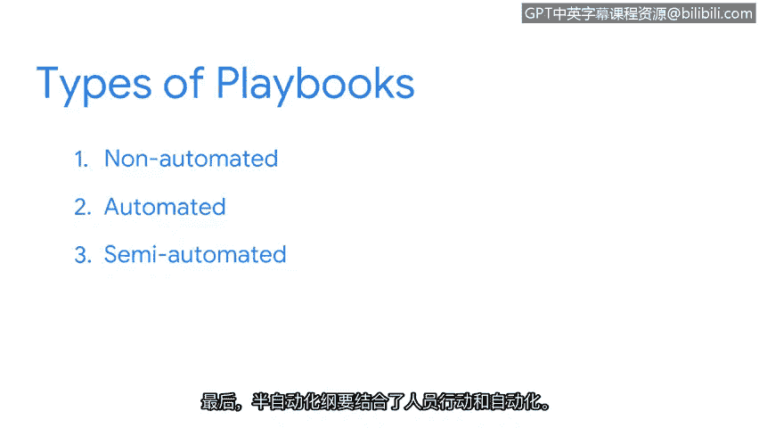

**谷歌网络安全专业证书第六课：6：网络安全预案的价值** 🛡️

在本节课中，我们将要学习网络安全预案的概念、类型及其在事件响应中的核心价值。预案为安全团队提供了清晰、有序的行动指南，是高效应对安全事件的关键工具。

---

你是否曾前往一个从未到访过的地方旅行？你可能使用过旅行行程单来规划活动。旅行行程单是重要的文档，尤其是在前往新地点时。它能帮助你保持条理，并清晰地展示旅行计划。它详细说明了你将进行的活动、访问的地点以及目的地之间的交通时间。

网络安全预案与旅行行程单类似。正如我们之前讨论过的，**预案**是一份提供任何操作行动细节的手册。它为安全分析师提供了事件发生时应采取的确切步骤说明。预案为安全专业人员描绘了在整个事件响应生命周期中所需完成任务的全景图。

---

事件响应有时可能充满不可预测性和混乱。安全团队需要快速有效地采取行动。预案通过清晰地概述响应特定事件时应采取的行动，为这一时期提供了结构和秩序。通过遵循预案，安全团队可以减少响应期间的猜测和不确定性。

这使得安全团队能够迅速且毫不犹豫地采取行动。没有预案，几乎不可能实现有效且迅速的事件响应。预案内部可能包含检查清单，这也能帮助安全团队在压力时期高效工作，确保他们记住完成事件响应生命周期中的每一步。

预案概述了应对诸如勒索软件、数据泄露、恶意软件或DDoS等攻击所必需的步骤。以下是一个使用流程图展示的预案示例，说明了在检测到DDoS攻击时应采取的步骤。

该图描绘了检测DDoS的过程，始于确定入侵指标，例如未知的入站流量。一旦确定了入侵指标，下一步是收集日志，最后分析证据。

---

预案主要有三种类型：**非自动化预案**、**自动化预案**和**半自动化预案**。

我们刚才探讨的DDoS预案就是一个**非自动化预案**的例子，它需要分析师逐步执行操作。

**自动化预案**则能自动化事件响应流程中的任务。例如，可以使用自动化预案来完成诸如对事件严重性进行分类或收集证据等任务。自动化预案有助于缩短事件解决时间。SOAR和SIEM工具可以配置来自动化预案。

最后，**半自动化预案**结合了人工操作与自动化。繁琐、易出错或耗时的任务可以实现自动化，而分析师则可以优先处理其他任务。半自动化预案有助于提高生产力并缩短解决时间。

---

当安全团队响应事件时，他们可能会发现预案需要更新或修改。威胁形势在不断演变，为了使预案保持有效，必须定期维护和更新。引入预案变更的一个绝佳时机是在**事后活动阶段**。我们将在后续章节中更详细地探讨这一阶段。

---

在本节课中，我们一起学习了网络安全预案如何像旅行行程单一样为事件响应提供结构和指导。我们了解了预案的三种主要类型（非自动化、自动化、半自动化）及其各自的应用场景，并认识到定期更新预案对于应对不断变化的威胁至关重要。预案是确保安全团队能够高效、有序、自信地应对安全事件的基础工具。