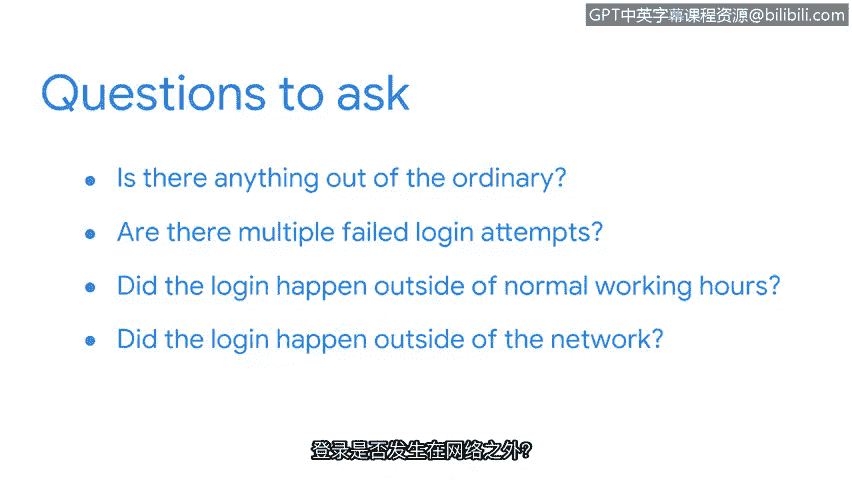

# 028：事故处理中的初步审查的作用 🚨

在本节课中，我们将学习网络安全中“初步审查”的概念及其在事故处理流程中的关键作用。初步审查是安全分析师高效管理海量警报、确定响应优先级的核心方法。

正如你所了解的，安全分析师在任何一天都可能被大量的警报所淹没。

那么，分析师如何管理所有这些警报呢？医院急诊科每天会接收大量病人，每位病人因不同原因需要医疗护理，但并非所有病人都能立即得到救治。这是因为医院的资源有限，必须高效管理时间和精力。他们通过一个被称为“分诊”的过程来实现这一点。

在医学领域，分诊用于根据病人病情的紧急程度对其进行分类。例如，患有心脏病等危及生命状况的病人将得到立即救治，而手指骨折等非危及生命状况的病人可能需要在见到医生前等待。分诊有助于管理有限资源，使医护人员能够优先处理最紧急的病人。

## 安全领域的初步审查

上一节我们了解了医学分诊，本节中我们来看看它在安全领域的应用。在警报升级之前，它会经过一个初步审查过程，该过程根据事件的重要或紧急程度确定优先级。与医院急诊科类似，安全团队用于事件响应的资源也是有限的。

并非所有事件都相同，有些可能需要紧急响应。事件根据其对系统**机密性、完整性和可用性**构成的威胁进行审查。例如，涉及勒索软件的事件需要立即响应，因为勒索软件可能造成财务、声誉和运营损害。勒索软件的优先级高于员工收到钓鱼邮件这类事件。

## 初步审查的时机与流程

初步审查何时发生？一旦检测到事件并发出警报，初步审查就开始了。作为安全分析师，你需要识别不同类型的警报，然后根据紧急程度确定其优先级。

初步审查流程通常如下所示：

以下是初步审查的一般步骤：

1.  **接收与评估警报**：首先，接收并评估警报，以确定其是否为误报，以及是否与现有事件相关。
2.  **分配优先级**：如果确认为真实阳性警报，则根据组织的政策和指南为其分配优先级。优先级定义了安全团队将如何响应该事件。
3.  **调查与收集证据**：最后，调查警报，并收集、分析与警报相关的任何证据，例如系统日志。

作为分析师，你需要确保完成彻底的分析，以便有足够的信息对你的发现做出明智的决策。

## 为调查添加上下文

例如，假设你收到一个用户登录失败的警报。你需要为调查添加上下文，以确定其是否具有恶意性。你可以通过提问来实现：

以下是调查登录失败警报时可以考虑的问题：

*   此警报是否有任何异常之处？
*   是否存在多次失败的登录尝试？
*   登录是否发生在正常工作时间之外？
*   登录是否发生在网络外部？

这些问题有助于描绘事件的全貌。通过添加上下文，你可以避免做出可能导致不完整或错误结论的假设。

## 总结与过渡

现在我们已经介绍了如何对警报进行初步审查，接下来我们准备讨论如何响应事件并从事件中恢复。让我们继续前进。

本节课中，我们一起学习了初步审查在网络安全事件处理中的核心作用。我们了解到，初步审查是一个类似于医疗分诊的优先级排序过程，它帮助安全团队在资源有限的情况下，根据事件对系统**机密性、完整性和可用性**的威胁程度，高效地确定响应顺序。掌握这一流程是有效管理警报、启动恰当响应的第一步。