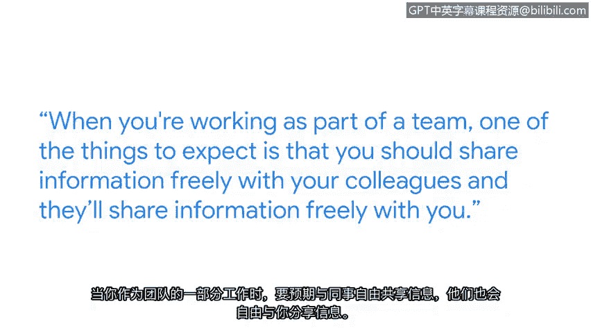

**谷歌网络安全专业证书第六课：6：跨团队合作**

在本节课中，我们将跟随谷歌红队项目管理负责人罗宾，学习网络安全工作中至关重要的跨团队协作技能。我们将了解团队合作的重要性、核心原则，并通过一个真实案例来体会其价值。

我的名字是罗宾，我是谷歌红队的项目管理负责人。

我认为团队合作可能是网络安全从业人员最重要的技能。协作文化的核心在于理解每个人都带来独特的视角、有用的观点和技能。团队合作之所以关键，是因为网络安全问题本身非常困难且复杂。网络攻击者很聪明，他们资源充足且动机强烈。因此，他们不断想出新的方法来实施攻击。

这就需要拥有各种视角、各种问题解决技能和各种知识的人聚集在一起，共同理解发生了什么以及我们如何防御。

上一节我们提到了团队合作的重要性，本节中我们来看看在团队中工作的具体期望。当你作为团队一员工作时，需要期待的是你应该与同事自由分享信息，他们也会在事件响应的初期和混乱阶段与你自由分享信息。所有信息都有用，因此要准备好立即投入工作。

以下是团队协作中的关键行动准则：
*   分享你所知道的一切。
*   倾听周围人所说的话。

这样我们才能尽快得出最佳解决方案。

---

在了解了团队协作的基本准则后，我们通过一个真实案例来看看其实际效果。在我担任现职后不久，我们经历了一次非常重大的安全事件。一个在互联网上许多不同地方被广泛使用的库中发现了一个严重的漏洞。

我是参与响应此事件的团队一员。我们组建的团队建立了一个响应流程，利用我们在世界各地的同事进行7x24小时不间断的覆盖。

我们经历的出色团队合作带来的最终结果是：
*   首先，我们成功管理了该漏洞。
*   但更重要的是，团队在事后凝聚的方式，以及人们至今仍在谈论我们出色的团队合作如何拉近了同事关系，这意味着我们的团队协作比以前更好了。我们现在做得非常好的这些团队协作方面，让我们所有人都感觉共同经历了一些事情，并且变得更加强大。

---

另一方面，在你学习这个证书课程的过程中，你可能会发现网络安全很棘手或很难，但请不要放弃。你学得越多，就越会享受其中。所以请坚持下去，尽可能学习一切知识，你将拥有一个伟大的职业生涯。

**总结**

本节课中，我们一起学习了网络安全中跨团队合作的核心价值。我们了解到，面对复杂且不断演变的威胁，汇集多元化的视角和技能至关重要。有效的团队协作要求自由分享信息、积极倾听，并能通过共同应对挑战来增强团队凝聚力。记住，持续学习是应对网络安全挑战和享受职业生涯的关键。