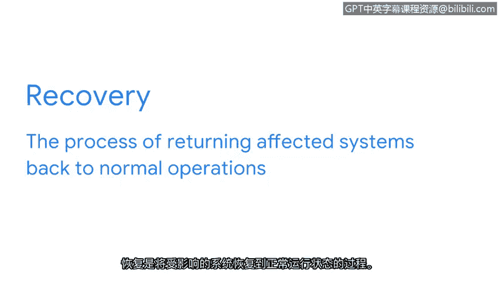

# 030：生命周期的封锁、清除和恢复阶段 🔒

在本节课中，我们将要学习事件响应生命周期的第三个阶段。这个阶段涵盖了安全团队如何对事件进行封锁、清除并从中恢复的步骤。理解这些步骤的相互关联性至关重要，因为封锁有助于实现清除的目标，而清除又为恢复奠定了基础。此阶段也与NIST网络安全框架的核心功能——“响应”和“恢复”——紧密集成。

## 封锁：限制损害蔓延 🛑

上一节我们介绍了事件响应的整体流程，本节中我们来看看具体行动的第一步：封锁。在检测到事件后，必须立即对其进行封锁。

**封锁**是指限制和防止事件造成额外损害的行为。组织通常会在其事件响应计划中预先制定详细的封锁策略。

以下是关于封锁策略的关键点：
*   封锁策略详细规定了安全团队在检测到事件后应采取的行动。
*   针对不同类型的事件，需要使用不同的封锁策略。

例如，对于单台计算机系统上的恶意软件事件，一个常见的封锁策略是通过断开网络连接来隔离受影响的系统。这可以防止恶意软件在网络中传播到其他系统。因此，事件被限制在单个受感染的系统内，从而限制了进一步的损害。封锁行动是从环境中移除威胁的第一步。

## 清除：根除所有威胁痕迹 🧹

一旦事件被成功封锁，安全团队便着手通过清除来移除事件的所有痕迹。

**清除**涉及从所有受影响的系统中彻底移除事件的构成元素。清除行动是恢复系统正常状态的关键前提。

以下是清除阶段可能采取的行动示例：
*   执行漏洞测试。
*   对与威胁相关的漏洞应用补丁。

## 恢复：恢复正常运营 🔄

最后，事件响应生命周期此阶段的最后一步是恢复。

**恢复**是将受影响的系统恢复到正常运营状态的过程。事件可能会在恢复期间中断关键的商业运营和服务。在此阶段，所有受事件影响的服务都将被带回正常运作状态。

以下是恢复阶段可能采取的行动：
*   对受影响系统进行重镜像。
*   重置密码。
*   调整网络配置，例如防火墙规则。

需要记住的是，事件响应生命周期是循环的。随着时间的推移，可能会发生多起事件，并且这些事件可能相互关联。安全团队可能需要返回到生命周期中的其他阶段，以进行额外的调查。

## 总结 📝

本节课中我们一起学习了事件响应生命周期的第三阶段。我们了解到，**封锁**旨在限制损害，**清除**是为了彻底移除威胁，而**恢复**则是让业务和系统回归正轨。这三个步骤环环相扣，共同构成了从安全事件中有效恢复的完整路径。接下来，我们将探讨生命周期的最后一个阶段。