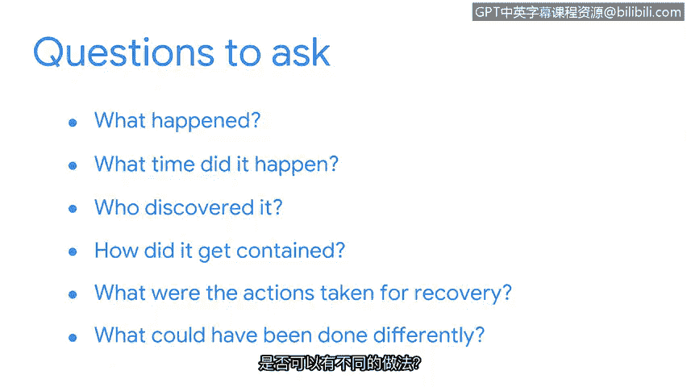

**谷歌网络安全专业证书第六课：6：拉响警报：检测与响应**

**P31：30_生命周期的事后活动阶段**

**概述**

在本节中，我们将学习事件响应生命周期的最后一个阶段：事后活动阶段。我们将了解安全团队在事件结束后如何通过回顾与分析，总结经验教训，并改进未来的响应流程。

**事后活动阶段介绍**

上一节我们介绍了事件的遏制、根除与恢复。当安全团队成功完成这些步骤后，他们的工作就结束了吗？并非如此。在网络安全领域，无论是面对新技术还是新漏洞，总有更多需要学习的地方。而学习和改进的最佳时机，就发生在事件响应生命周期的最终阶段——事后活动阶段。

事后活动阶段的核心是**回顾事件**，以识别在整个事件处理过程中可以改进的领域。

**更新与创建文档**

在此阶段，安全团队会更新或创建不同类型的文档。其中一种关键文档是**最终报告**。

**最终报告**是一份提供事件全面回顾的文档。它包含与事件相关的所有事件的时间线和详细信息，以及未来预防的建议。

**召开经验总结会议**

在事件发生时，安全团队的目标是集中精力进行响应和恢复。事件结束后，团队的工作重点则转向**最小化事件再次发生的风险**。改进流程的一种有效方式是召开**经验总结会议**。

经验总结会议邀请所有参与事件处理的各方参加，通常在事件发生后两周内举行。会议期间，团队会回顾事件，确定发生了什么、采取了哪些行动以及这些行动的效果如何。最终报告是此次会议的主要参考文件。

经验总结会议讨论的目标是分享关于事件的想法和信息，并探讨如何改进未来的响应工作。

以下是经验总结会议上可以提出的一些问题：

*   发生了什么？
*   事件在什么时间发生？
*   谁发现了它？
*   它是如何被遏制的？
*   为恢复采取了哪些行动？
*   有哪些可以做得不同的地方？

**从错误中学习**

事件回顾可能会揭示在检测和响应过程中出现的人为错误。无论是安全分析师在恢复过程中遗漏了一个步骤，还是一名员工点击了钓鱼邮件中的链接导致恶意软件传播，都应避免因某人做了或没做某事而指责他们。

相反，安全团队应将此视为一个**从已发生事件中学习并改进**的机会。

**总结**

本节课中，我们一起学习了事件响应生命周期的最后阶段——事后活动阶段。我们了解到，通过创建最终报告、召开经验总结会议以及建设性地分析错误，安全团队能够将每次安全事件转化为宝贵的经验，从而持续优化响应流程，提升组织的整体安全防护能力。