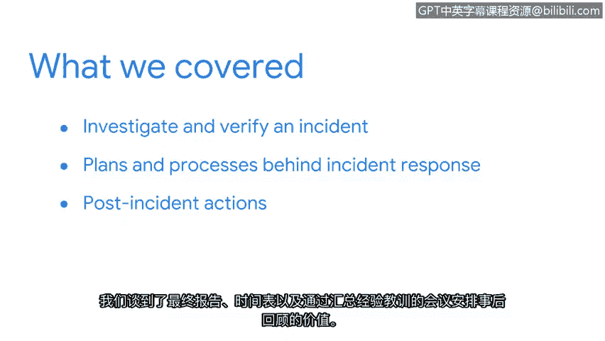

# 032：检测与响应

## 概述
在本节课中，我们将总结事件调查与响应的核心流程。我们将快速回顾NIST事件响应生命周期的各个阶段，包括检测、分析、遏制、根除、恢复以及事后行动。

## 事件调查与响应总结

关于事件调查与响应的讨论到此结束。恭喜你完成了又一个章节的学习。我们在此涵盖了大量内容。

现在，让我们花点时间快速回顾一下。

首先，我们重温了NIST事件响应生命周期中的检测与分析阶段，并重点探讨了如何调查和验证一个事件。

我们讨论了检测的目的，以及如何利用**入侵指标**来识别系统上的恶意活动。

接下来，我们审视了事件响应背后的计划与流程，例如**文档记录**和**事件分级分类**。

随后，我们探讨了遏制与根除事件的策略，以及如何从事件中恢复。

最后，我们分析了事件生命周期的最后一个阶段——事后行动。我们讨论了最终报告、时间线，以及通过经验教训会议安排事后审查的价值。

作为一名安全分析师，你将负责完成事件响应生命周期每个阶段所涉及的一些流程。

在接下来的课程中，你将学习关于日志的知识，并有机会使用模拟环境来探索它们。

## 总结
本节课中，我们一起学习了事件响应生命周期的完整流程，从最初的检测分析到最终的事后总结与改进。掌握这些阶段和核心概念，是有效应对安全事件的基础。