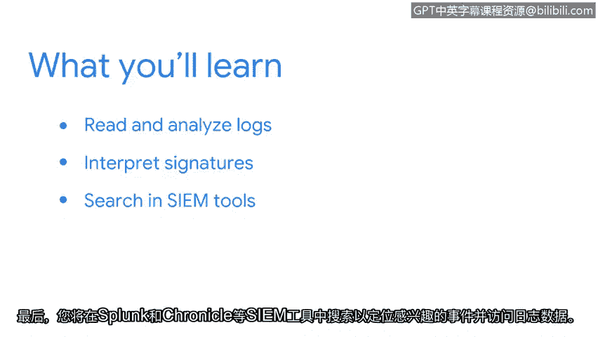

**网络安全基础：第六课：第四周：日志与警报分析入门**

在本节课中，我们将学习网络安全事件调查的核心组成部分：日志与警报。我们将了解什么是日志、如何创建和分析它们，并探索如何使用工具来解读入侵检测系统的签名和搜索安全事件。

---

历史书籍、收据、日记。这些东西有什么共同点？它们都记录事件。

无论是历史事件、金融交易还是私人日记条目，记录都保存了事件的细节。获取这些细节能在许多方面帮助我们。

上一节我们探讨了事件响应生命周期每个阶段涉及的不同流程和程序。本节中，我们将重点关注事件调查的关键组成部分之一：日志与警报。

在安全领域，日志记录事件详情，这些详情用于支持调查。首先，你将全面了解日志：它们是什么以及如何生成。你还将学习如何阅读和分析日志。接着，你将重新审视入侵检测系统，探索如何解读签名。你将有机会通过使用名为 **Sracottta** 的工具进行实践操作来应用所学知识。最后，你将在 **Splunk** 和 **Chronicle** 等 SIEM 工具中搜索感兴趣的事件并访问日志数据。

---

事件是宝贵的数据源。它们有助于围绕警报建立上下文，从而让你能够解读系统上发生的操作。掌握如何阅读、分析并关联不同事件，将帮助你识别恶意行为并保护系统免受攻击。

我们开始吧。