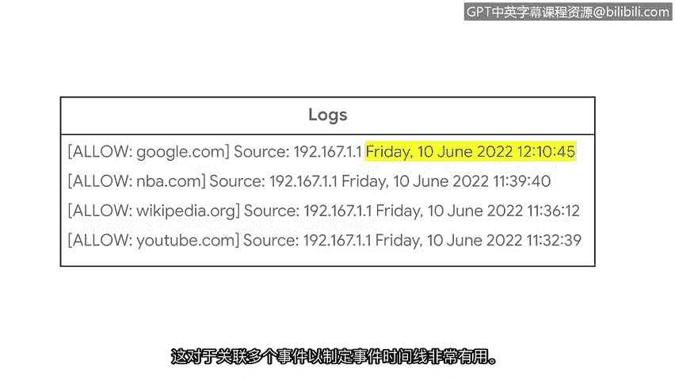

# 034：日志的重要性 🔍


在本节课中，我们将要学习网络安全中的一个核心概念：日志。日志是记录系统、网络和设备活动的关键数据源，对于检测异常、调查安全事件至关重要。我们将了解日志是什么、它们如何生成、包含哪些信息，以及安全分析师如何利用它们。

---

## 什么是日志？📝

上一节我们提到了设备以事件的形式产生数据。作为回顾，事件是指在网络、系统或设备上发生的可观察到的活动。这些数据为我们提供了环境的可见性。

日志是安全专业人员检测异常或恶意活动的关键方式之一。**日志**是记录组织系统内发生事件的记录。系统活动被记录在所谓的**日志文件**中，通常简称为日志。

几乎每个设备或系统都能生成日志。日志包含多个条目，详细描述了特定事件或发生情况的信息。

---

## 日志的作用与重要性 🔎

在事件调查期间，日志对安全分析师非常有用，因为它们记录了网络上事件发生的**内容**、**地点**和**时间**。这包括诸如日期、时间、位置、执行的操作以及执行操作的用户或系统名称等详细信息。

这些细节不仅为排查与系统性能相关的问题提供了宝贵的见解，更重要的是，它们对于安全监控至关重要。日志允许分析师围绕各种事件的发生构建故事和时间线，以准确理解发生了什么。这是通过**日志分析**来完成的。

**日志分析**是检查日志以识别感兴趣事件的过程。

---

## 高效记录日志的策略 ⚙️

由于获取日志的来源不同，并且可能生成海量的日志数据，因此有选择性地记录日志有助于提高效率。

例如，Web应用程序会生成大量的日志消息，但并非所有这些数据都与调查相关。事实上，不相关的数据甚至可能拖慢调查速度。从日志记录中排除特定数据有助于减少搜索日志数据所花费的时间。

您可能还记得我们关于**SIEM技术**的讨论。SIEM工具为安全专业人员提供了网络活动的高级概览。SIEM工具首先从多个数据源收集数据，然后将数据**聚合**或**集中**到一个地方。最后，不同的日志格式被**规范化**或转换为单一的首选格式。

SIEM工具帮助实时处理来自多个数据源的大量日志。这使得安全分析师能够快速搜索日志数据并执行日志分析，以支持他们的调查。

---

## 日志的收集与来源 📥

那么，日志是如何被收集的呢？被称为**日志转发器**的软件会从各种来源收集日志，并自动将它们转发到集中式的日志存储库进行存储。

由于不同类型的设备和系统都可以创建日志，因此环境中存在不同的日志数据源。这些来源包括：
*   **网络日志**：由代理、路由器、交换机和防火墙等设备生成。
*   **系统日志**：由操作系统生成。
*   **应用程序日志**：与软件应用程序相关的日志。
*   **安全日志**：由IDS或IPS等安全工具生成。
*   **认证日志**：记录登录尝试。

---

## 日志分析实例 📄

以下是一个来自路由器的网络日志示例。这里有几个日志条目，但我们将重点关注第一行。

```
action: allow, source: 192.0.2.1, destination: google.com, timestamp: 2023-10-27T14:30:00Z
```

我们可以观察到几个字段：
1.  **action**：指定为 `allow`。这意味着路由器的防火墙设置允许从特定IP地址访问 google.com。
2.  **source**：列出了一个IP地址 `192.0.2.1`。
3.  **destination**：目标地址是 `google.com`。
4.  **timestamp**：时间戳 `2023-10-27T14:30:00Z`，这是日志中最重要的字段之一。

到目前为止，这个日志条目的信息告诉我们，来自源IP地址 `192.0.2.1` 到 `google.com` 的网络流量是被允许的。时间戳字段使我们能够识别操作发生的准确日期和时间。这对于关联多个事件以构建事件时间线非常有用。

---



## 总结 ✨

本节课中我们一起学习了日志的基础知识。我们了解到，日志是系统和网络活动的详细记录，是安全监控和事件调查的基石。通过日志分析，安全分析师可以追溯事件、构建时间线并识别潜在威胁。我们还探讨了如何通过SIEM工具和选择性记录策略来高效地管理和利用海量日志数据。接下来，我们将继续讨论日志，并探索不同的日志格式。