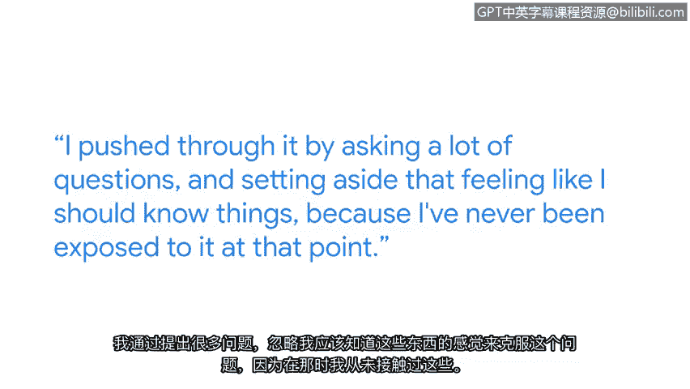

**网络安全：第六课：拉响警报：检测与响应**

**概述**

在本节课中，我们将跟随谷歌安全工程师丽贝卡的分享，了解学习网络安全新工具与技术时可能遇到的挑战，并学习如何克服这些困难，最终提升自己的专业能力与职业前景。

---

**第六课：P35：丽贝卡谈学习新工具与技术**

我是丽贝卡，是谷歌的一名安全工程师，专注于身份管理领域。

工作中最棒的部分可能就是像攻击者一样思考。我非常喜欢这个环节：观察如何破坏系统，审视一个系统并思考，如果我是一个坏人，我会如何侵入它。我会想要什么，我会寻找什么，我会如何找到凭证，以及如何找到有用的机器并成功进入。

我从事安全工作的第一天，我们就在学习一个新工具。整个组织都非常重视培训，他们直接让我投入其中，那是一个为期一周的学习网络分析器的培训。

当时我对网络一无所知，更不用说网络安全或这个工具将用于何处。因此我感到非常不知所措，因为我感觉自己像一个冒名顶替者，坐在本应属于别人的位置上，学习着远超我理解范围的东西。

我通过提出大量问题来推动自己前进，并放下了那种“我应该知道”的感觉，因为在那之前我从未接触过这些。我明白，要想知道，唯一的途径就是提问。

这门课程包含许多工具，涵盖大量信息，很容易让人感到不知所措。事实上，如果是我，可能也会如此。这里有太多信息需要吸收。

我认为学习这样一门课程——它是一系列课程中的一部分——就像攀登一座高山。你已经爬到了很高的地方，空气变得稀薄，是的，这很困难。你会感到不知所措，但你离山顶已经很近了。

现在，当你到达山顶时，你将看到世界壮丽的景色。完成这些课程也是如此，你的思维方式、你看待事物的角度、你的能力，以及你寻找新工作或转换职业的潜力，都将得到极大的提升。

---

**总结**

本节课中，我们一起学习了丽贝卡关于学习网络安全新工具的心得。她强调了像攻击者一样思考的重要性，并坦诚分享了初学时的困难与克服方法：勇于提问、接纳未知。她将学习过程比作登山，鼓励我们在感到困难时坚持下去，因为登顶后的视野和能力提升将带来巨大的回报。