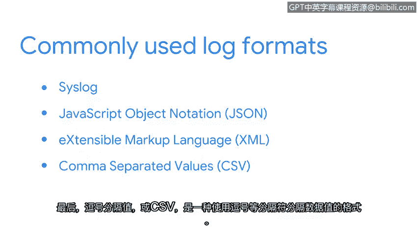

# 036：日志的不同类型 📝


在本节课中，我们将要学习日志在网络安全中的核心作用，以及几种常见的日志格式。理解日志的格式和内容是安全分析师进行事件检测与响应的基础。

---

当你在商店购买商品时，通常会收到一张收据作为购买记录。这张收据会分解交易信息，包含诸如日期、时间、收银员姓名、商品名称、价格和支付方式等细节。但并非所有商店的收据看起来都一样。例如，汽车维修发票在列出所售商品或服务时会使用大量细节。而餐厅的收据则不太可能包含如此详尽的信息。尽管商店收据之间存在差异，但所有收据都包含与交易相关的重要细节。

日志与收据类似。收据记录购买行为，而**日志则记录在网络或系统上发生的事件或活动**。作为安全分析师，你将负责解读日志。日志有不同的格式，因此并非所有日志看起来都一样，但它们通常包含诸如时间戳、系统特征（如IP地址）以及事件描述（包括采取的行动和执行者）等信息。

我们知道，日志可以由许多不同的数据源生成，例如网络设备、操作系统等。这些日志源以不同的格式生成日志。有些日志格式设计为**人类可读**，而另一些则是**机器可读**。有些日志可能非常详细，包含大量信息，而有些则简短明了。接下来，让我们探讨一些常用的日志格式。

---

以下是几种常见的日志格式：

**1. Syslog**
Syslog 既是一种协议，也是一种日志格式。作为协议，它负责传输和写入日志；作为日志格式，它包含一个头部，后跟结构化数据和消息。
一个 Syslog 条目包含三个部分：头部、结构化数据和消息。
*   **头部**：包含时间戳、主机名、应用程序名称和消息ID等数据字段。
*   **结构化数据**：以键值对的形式包含额外的数据信息。例如，键 `eventSource` 的值 `application` 指定了日志的数据源。
*   **消息**：包含关于事件的详细日志信息。在本例中，`“This is a log entry.”` 就是消息。

**2. JSON (JavaScript Object Notation)**
JSON 是一种基于文本的格式，设计目标是易于读写。它也使用键值对来结构化数据。
以下是一个 JSON 日志示例：
```json
{
  "alert": "malware",
  "timestamp": "2023-10-27T10:00:00Z",
  "sourceIP": "192.168.1.100"
}
```
花括号 `{}` 表示一个对象的开始和结束。对象是括号之间的数据，使用键值对进行组织，每个键通过冒号 `:` 对应一个值。例如，第一行的键是 `"alert"`，值是 `"malware"`。JSON 以其简单性和易读性著称，作为安全分析师，你将使用 JSON 来读写日志等数据。

**3. XML (Extensible Markup Language)**
XML 是一种用于存储和传输数据的语言和格式。它不使用键值对，而是使用标签和其他键来结构化数据。
以下是一个 XML 日志条目的示例：
```xml
<logEntry>
  <firstName>Alex</firstName>
  <lastName>Rivera</lastName>
  <employeeID>12345</employeeID>
  <dateJoined>2023-01-15</dateJoined>
</logEntry>
```
字段如 `firstName`、`lastName` 等被包含在箭头标签 `< >` 中。

**4. CSV (Comma-Separated Values)**
CSV 是一种使用分隔符（如逗号）来分隔数据值的格式。
以下是一个 CSV 日志示例：
```
timestamp, alert, sourceIP, destinationIP
2023-10-27T10:00:00Z, malware, 192.168.1.100, 10.0.0.1
```
在这个例子中，许多不同的数据字段用逗号分隔。

---



现在你已经了解了日志格式的多样性，接下来可以专注于评估日志，为检测构建上下文。在后续内容中，你将探索如何使用入侵检测系统（IDS）签名来检测、记录和告警可疑活动。

在本节课中，我们一起学习了日志的核心概念及其类比，并详细介绍了四种常见的日志格式：Syslog、JSON、XML 和 CSV。理解这些格式是有效分析安全事件、从海量数据中提取关键信息的第一步。