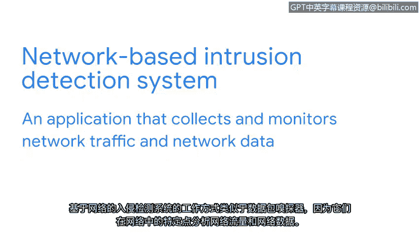

# 037：使用检测工具进行安全监控 🔍

在本节课中，我们将学习安全监控的核心概念，了解不同的检测技术如何收集和分析数据以发现潜在威胁。我们将重点介绍基于主机和基于网络的入侵检测系统，以及它们的工作原理。

---

检测需要数据，这些数据可以来自各种数据源。你已经探索了不同设备如何生成日志。现在，我们将研究不同的检测技术如何监控设备，并记录不同类型的系统活动，例如网络遥测和端点遥测。

遥测是为分析而进行的数据收集和传输，而日志记录的是系统上发生的事件。遥测描述的是数据本身，例如，数据包捕获被视为网络遥测。对于安全专业人员而言，日志和遥测是证据来源，可用于在调查期间回答问题。

---

上一节我们介绍了入侵检测系统（IDS）的基本概念。接下来，本节中我们来看看它如何应用于不同的监控对象。

IDS是一种监控活动并对可能的入侵发出警报的应用程序。这包括监控系统或网络的不同部分，例如端点。

**端点**是连接到网络的任何设备，例如笔记本电脑、平板电脑、台式计算机或智能手机。端点是进入网络的入口点，这使其成为试图获得系统未授权访问的恶意行为者的主要目标。

为了监控端点是否存在威胁或攻击，可以使用**基于主机的入侵检测系统**。它是一种监控其安装所在主机活动的应用程序。需要说明的是，主机是网络上与其他设备通信的任何设备，类似于端点。基于主机的入侵检测系统作为代理安装在单个主机上，例如笔记本电脑或服务器。根据其配置，它将监控其安装所在的主机，以检测可疑活动。一旦检测到异常，它会将输出记录为日志并生成警报。

---

那么，如果我们想要监控整个网络呢？本节我们将探讨基于网络的入侵检测系统。

**基于网络的入侵检测系统**收集并分析网络流量和网络数据。它的工作原理类似于数据包嗅探器，因为它分析网络上特定点的网络流量和数据。通常会在网络的不同点部署多个IDS传感器，以实现充分的可见性。当检测到可疑或不寻常的网络活动时，基于网络的入侵检测系统会将其记录并生成警报。在此示例中，基于网络的入侵检测系统正在监控进出互联网的流量。

---

入侵检测系统使用不同类型的检测方法。其中最常见的方法之一是签名分析。

**签名分析**是一种用于发现感兴趣事件的检测方法。签名指定了一组规则，IDS在监控活动时会参考这些规则。如果活动与签名中的规则匹配，IDS会记录并发出警报。例如，可以编写一个签名，在系统上连续发生三次登录失败时生成警报，这表明可能存在密码攻击。

在生成警报之前，活动必须被记录下来。IDS技术将其监控的设备、系统和网络的信息记录为**IDS日志**。然后，这些IDS日志可以被发送、存储和分析在集中的日志存储库中，例如安全信息与事件管理（SIEM）系统。

---

在本节课中，我们一起学习了安全监控的基础知识。我们了解了遥测与日志的区别，探讨了基于主机和基于网络的入侵检测系统如何工作以保护端点和网络。我们还介绍了签名分析这一核心检测方法，它通过预定义的规则集来识别威胁。最后，我们知道了IDS生成的日志会被集中管理以便进一步分析。接下来，我们将探索如何读取和配置签名。