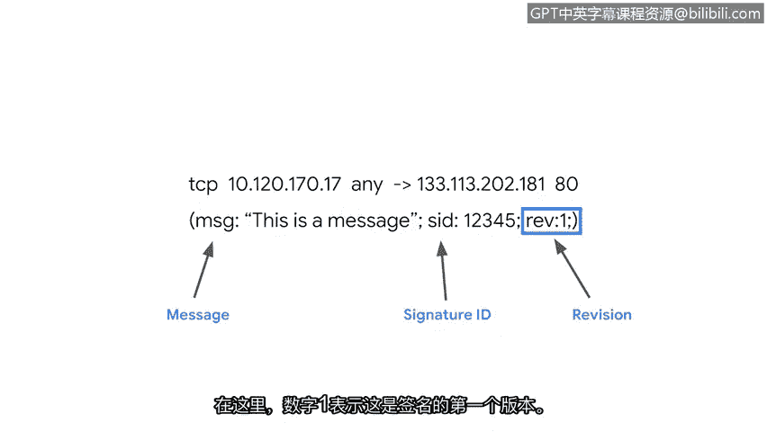
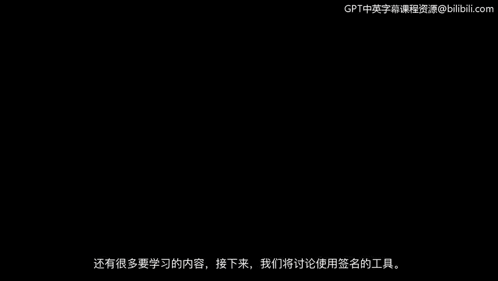

# 039：检测签名的组成部分 🔍


在本节课程中，我们将学习网络入侵检测系统（NIDS）中签名的基本构成。签名是定义检测规则的核心，理解其语法是安全分析师编写、定制和测试检测规则的基础。我们将详细拆解签名的三个主要组成部分：动作、头部和规则选项。

## 签名的定义与作用

作为安全分析师，您可能需要编写、定制或测试签名。为此，您将使用入侵检测系统工具。在本节中，我们将研究签名的语法。学习结束后，您将能够阅读一个签名。

签名规定了检测规则。这些规则概述了您希望入侵检测系统检测的网络入侵类型。例如，可以编写一个签名来检测并告警试图连接到某个端口的可疑流量。

## 签名规则的组成部分

不同网络入侵检测系统的规则语言各不相同。术语“网络入侵检测系统”常缩写为NIDS。通常，NIDS规则由三个部分组成：一个动作、一个头部和规则选项。

现在，让我们更详细地检查这三个组成部分。

### 动作

通常，动作是签名中指定的第一项。它决定了当满足规则匹配条件时要采取的行动。

不同NIDS规则语言中的动作可能不同，但一些常见的动作包括：`alert`（告警）、`pass`（放行）或`reject`（拒绝）。

使用我们的例子，如果一条规则规定要对建立异常端口连接的可疑网络流量发出告警，那么入侵检测系统将检查流量数据包并发出告警。

### 头部

头部定义了签名的网络流量特征。它包括诸如源IP地址和目标IP地址、源端口和目标端口、协议以及流量方向等信息。

如果我们想要检测并告警连接到端口的可疑流量，我们必须首先在头部定义可疑流量的来源。可疑流量可能源自本地网络之外的IP地址。它也可能使用特定或不寻常的协议。我们可以在头部指定这些外部IP地址和协议。

以下是一个基本规则中头部信息可能呈现的示例：

```
tcp 10.120.170.17 any -> 133.113.202.181 80
```

首先，我们可以观察到协议`tcp`是签名中列出的第一项。接下来，指定了源IP地址`10.120.170.17`，源端口号为`any`（任何）。签名中间的箭头表示网络流量的方向。因此我们知道它源自源IP `10.120.170.17` 的任意端口，流向目标IP地址 `133.113.202.181` 的目标端口 `80`。

### 规则选项

规则选项允许您使用附加参数自定义签名。有许多不同的选项可供使用。例如，您可以设置选项来匹配网络数据包的内容，以检测恶意负载。

恶意负载驻留在数据包的数据部分，并执行删除或加密数据等恶意活动。配置规则选项有助于缩小网络流量范围，从而精确找到您要查找的内容。

典型的规则选项由分号分隔，并括在括号内。在此示例中，我们可以检查到规则选项被括在一对括号中，并且也用分号分隔。

```
(msg:"This is a message"; sid:100001; rev:1;)
```

第一个规则选项 `msg`（代表“消息”）提供告警文本。在本例中，告警将打印出文本“This is a message”。还有选项 `sid`，代表签名ID。这为每个签名附加一个唯一ID。`rev` 选项代表修订版本。每次签名更新或更改时，修订号都会更改。这里的数字 `1` 表示它是该签名的第一个版本。

## 总结与展望



很好，现在您已经在成为安全分析师的旅程中掌握了另一项技能：如何阅读签名。还有更多知识需要学习。接下来，我们将讨论使用签名的工具。

---



本节课中，我们一起学习了网络入侵检测系统签名的核心结构。我们了解到一个完整的签名主要由**动作**、**头部**和**规则选项**三部分组成。动作决定匹配后的行为，头部定义流量特征，而规则选项则提供了丰富的参数用于精确匹配和自定义告警信息。理解这些组成部分是有效利用IDS进行威胁检测的基础。