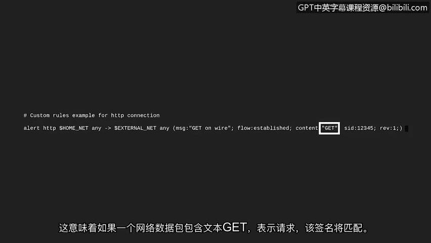

# 040：使用Suricata检查签名 🔍


在本节中，我们将学习如何使用开源的基于签名的入侵检测系统（IDS）——Suricata，来具体检查和分析一个预写的签名规则。我们将了解签名的结构、各个组成部分的含义，以及如何解读其检测逻辑。

---

## 概述

之前，我们学习了基于签名的分析方法，也了解了如何阅读网络入侵检测系统（NIDS）中使用的签名。本节我们将通过实际操作，使用Suricata来检查一个具体的签名，从而加深对签名规则工作原理的理解。

## 检查Suricata签名

许多入侵检测技术都附带预写的签名。你可以将这些签名视为可自定义的模板，类似于文字处理器中提供的不同模板。这些签名模板为你编写和定义自己的规则提供了一个起点。当然，你也可以编写并添加自己的规则。

现在，让我们通过Suricata来检查一个预写的签名。

在这台运行Ubuntu的Linux机器上，Suricata已经安装完毕。首先，我们通过改变目录到 `/etc` 目录下的 `suricata` 目录来查看它的一些文件。这里是Suricata所有配置文件的存放位置。

```bash
cd /etc/suricata
```

接下来，我们使用 `ls` 命令列出Suricata目录的内容。

```bash
ls
```

目录中有几个不同的文件，但我们将重点关注 `rules` 文件夹。预写的签名就存放在这里，你也可以在此添加自定义签名。

我们使用 `cd` 命令，后跟文件夹名称，来导航到该文件夹。

```bash
cd rules
```

使用 `ls` 命令，我们可以观察到该文件夹包含了一些针对不同协议和服务的规则模板。

```bash
ls
```

让我们使用 `less` 命令来检查 `custom-do.rules` 文件。快速回顾一下，`less` 命令会一次一页地返回文件内容，这使得前后浏览内容变得很容易。

```bash
less custom-do.rules
```

我们将使用方向键向上滚动。以井号（`#`）开头的行是注释，旨在为阅读者提供上下文，Suricata会忽略这些行。

第一行写着：“custom rules example for HTTP connection”。这告诉我们，此文件包含针对HTTP连接的自定义规则。

我们可以观察到其中有一个签名。签名的第一个词指定了其**动作**。对于这个签名，动作为 `alert`。这意味着当满足所有条件时，该签名会生成警报。

签名的下一部分是**头部**。它指定了协议 `http`、源IP地址 `$HOME_NET`、源端口定义为 `any`。

箭头（`->`）指示了流量的方向：来自家庭网络（`$HOME_NET`），去往目的IP地址 `$EXTERNAL_NET` 和任何目的端口（`any`）。

到目前为止，我们知道这个签名在检测到任何离开家庭网络、前往外部网络的HTTP流量时会触发警报。

让我们检查签名的其余部分，以确定是否存在签名需要寻找的额外条件。

签名的最后一部分包括**规则选项**。它们被括在括号内，并用分号分隔。这里列出了许多选项，但我们将重点关注 `msg`、`flow` 和 `content` 选项。

- `msg` 选项将在警报触发时显示消息 “GET on wire”。
- `flow` 选项用于匹配网络流量的方向。这里它是 `established`，这意味着连接已成功建立。
- `content` 选项检查数据包的内容。在引号之间，指定了文本 “GET”。GET是一种HTTP请求方法，用于从服务器检索和请求数据。这意味着，如果一个网络数据包包含文本“GET”（表示一个请求），该签名就会匹配。

综上所述，这个签名会在Suricata观察到来自家庭网络、前往外部网络的HTTP连接中出现文本“GET”时发出警报。



每个环境都是不同的。为了使入侵检测系统（IDS）有效，必须对签名进行测试和定制。作为安全分析师，你可能会测试、修改或创建IDS签名，以提高环境中威胁的检测能力，并减少误报的可能性。

接下来，我们将研究Suricata如何记录事件。我们稍后见。

---

## 总结


在本节中，我们一起深入学习了如何使用Suricata检查签名。我们了解了签名文件的结构，包括动作、头部和规则选项等关键部分，并解析了一个具体HTTP GET请求检测签名的逻辑。理解如何阅读和解释这些规则，是有效配置和管理基于签名的入侵检测系统的基础。