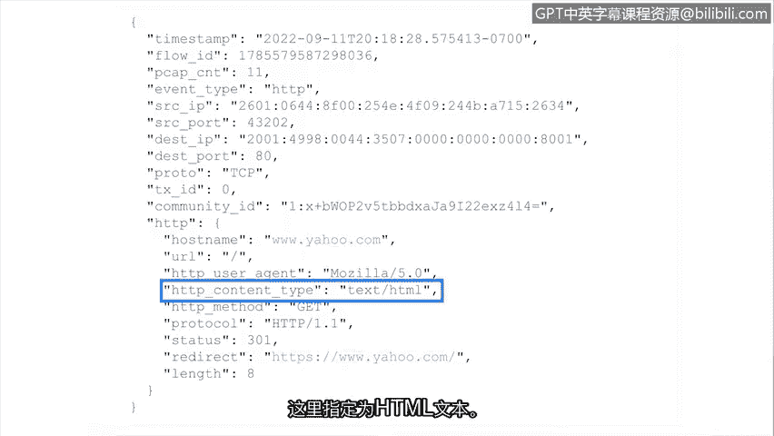

**谷歌网络安全专业证书第六课：拉响警报：检测与响应：P41：检查Suricata日志** 🕵️‍♂️


在本节中，我们将学习如何检查由Suricata生成的日志。Suricata是一种网络安全监控工具，它会输出两种主要类型的日志数据：警报日志和网络遥测日志。理解这些日志的格式和内容对于进行有效的安全调查至关重要。

---

### **日志格式：Eve JSON**

首先，我们来了解一下Suricata输出日志的格式。Suricata的警报和事件以一种称为 **Eve JSON** 的格式输出。

*   **Eve** 代表“可扩展事件格式”。
*   **JSON** 代表“JavaScript对象表示法”。

正如之前所学，JSON使用 **键值对** 来组织数据。这种结构简化了从日志文件中搜索和提取文本的过程。

```json
{
  "key1": "value1",
  "key2": "value2"
}
```

---

### **日志类型**

Suricata主要生成两种类型的日志数据。上一节我们介绍了日志的通用格式，本节中我们来看看这两种具体类型及其用途。

以下是两种主要的日志类型：

1.  **警报日志**：此类日志包含与安全调查相关的信息。通常是触发警报的签名（规则）的输出。例如，一个检测到网络中可疑流量的签名会生成一个警报日志，捕获该流量的详细信息。
2.  **网络遥测日志**：此类日志包含关于网络流量流的信息。网络遥测信息并不总是与安全直接相关，它只是记录网络上发生的事件，例如连接到特定端口。

这两种日志类型都能在调查过程中为构建事件脉络提供信息。

---

### **日志示例分析**

现在，让我们通过具体示例来深入理解这两种日志。以下是每种日志的一个例子。

**1. 警报日志示例**

```json
{
  “event_type”: “alert”,
  “src_ip”: “192.168.1.100”,
  “dest_ip”: “10.0.0.5”,
  “proto”: “TCP”,
  “alert”: {
    “signature_id”: 20001234,
    “message”: “ET MALWARE Windows Executable Download”
  }
}
```

我们可以通过 `event_type` 字段值为 `alert` 来判断这是一个警报事件。日志中还记录了活动的详细信息，包括源IP地址（`src_ip`）、目的IP地址（`dest_ip`）和协议（`proto`）。此外，还有关于签名本身的细节，例如签名消息（`message`）和ID（`signature_id`）。从签名消息看，此警报与检测到恶意软件下载有关。

**2. 网络遥测日志示例**

```json
{
  “event_type”: “http”,
  “hostname”: “www.example.com”,
  “http”: {
    “hostname”: “www.example.com”,
    “url”: “/index.html”,
    “http_user_agent”: “Mozilla/5.0”,
    “http_content_type”: “text/html”
  }
}
```

这个示例展示了一个网络遥测日志，它记录了对一个网站的HTTP请求详情。`event_type` 字段告诉我们这是一个HTTP日志。请求的详细信息包括：访问的网站（`hostname`）、用户代理（`http_user_agent`，即连接至网站的软件名称，本例中是网页浏览器Mozilla 5.0）以及内容类型（`http_content_type`，即HTTP请求返回的数据类型，此处指定为HTML文本）。

---

### **总结**



本节课中，我们一起学习了如何检查Suricata日志。我们首先认识了Suricata使用的 **Eve JSON** 日志格式，然后区分了 **警报日志** 和 **网络遥测日志** 这两种类型，并通过具体示例分析了它们各自包含的关键信息。掌握这些日志的解读方法是进行网络安全监控和事件响应的基础技能。在接下来的实践活动中，你将有机会亲手操作Suricata，应用本节所学的知识。祝你学习愉快！